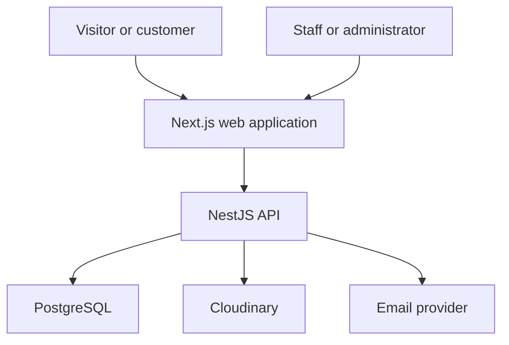
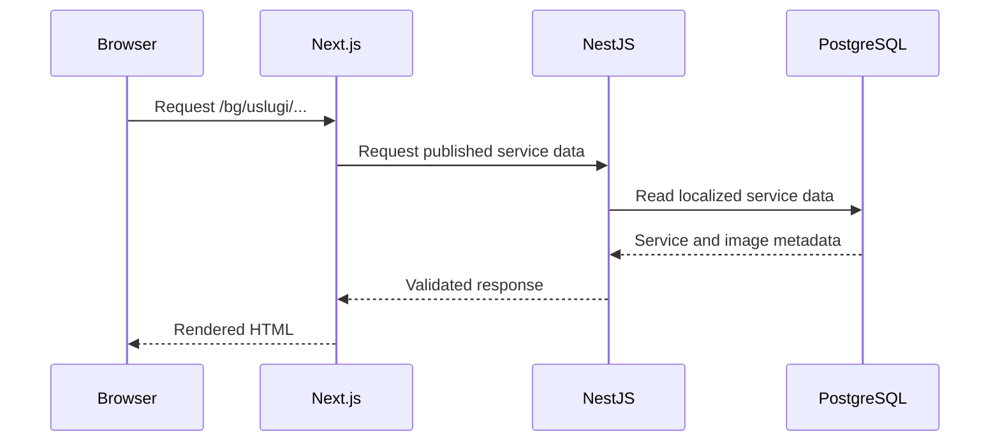
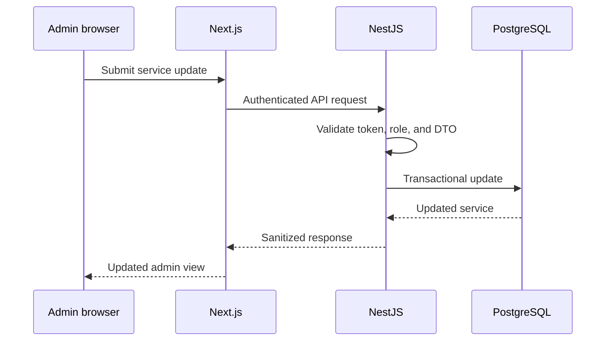
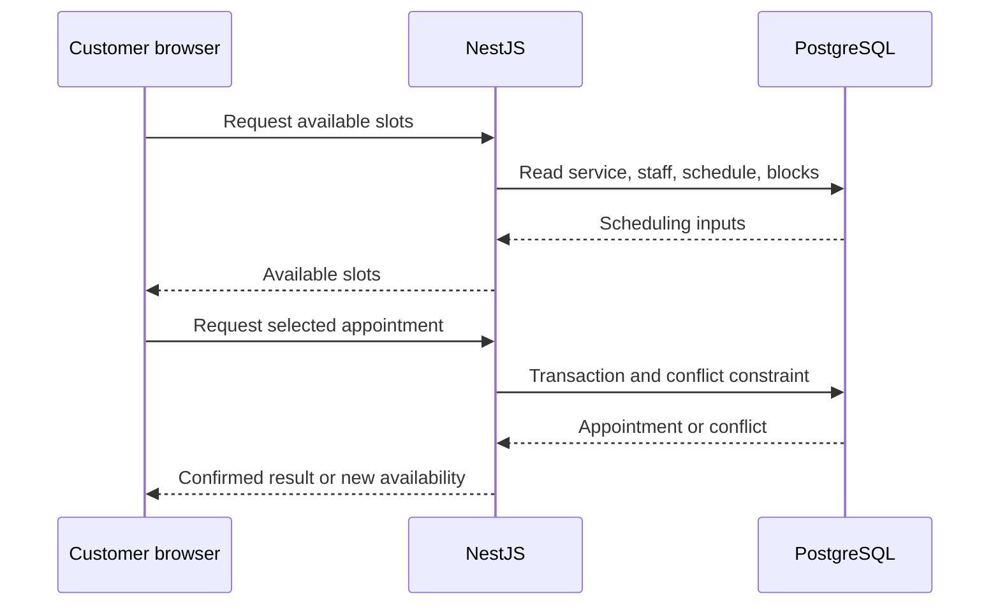

# Estetica Plus System Architecture

## 1. Purpose

This document defines the approved high-level architecture and ownership boundaries for Estetica Plus.

It is the primary reference for structural decisions. Detailed implementation rules belong in the numbered files under `docs/`.

AI agents and contributors must not introduce a second backend, ORM, authentication owner, or media-storage path without an approved Architecture Decision Record.

## 2. Architecture Principles

1. **One backend owner**  
   NestJS owns business logic, authentication, authorization, and database access.

2. **One database owner**  
   Prisma is the only ORM and migration owner. Prisma is used only by NestJS.

3. **Clear frontend boundary**  
   Next.js renders the website and portals and communicates with NestJS through a documented API.

4. **Server-first public pages**  
   Public marketing and service pages use Server Components by default. Client Components are introduced only for genuine browser interaction.

5. **Mobile-first performance**  
   Design and implementation begin with constrained mobile devices and networks, then enhance tablet and desktop layouts.

6. **Database-enforced booking safety**  
   Availability checks in application code are not sufficient. Transactions, indexes, and database constraints protect against conflicting appointments.

7. **External image delivery**  
   Image binaries are stored and delivered by Cloudinary. The VPS and PostgreSQL do not serve or store original image files.

8. **Security by default**  
   Authentication tokens, admin operations, personal data, uploads, and public forms are protected from their first implementation.

9. **Bilingual content from the start**  
   Bulgarian and English are part of routing, content modeling, metadata, images, and validation from the beginning.

10. **Incremental implementation**  
    Documentation and business rules are approved before scaffolding or generating large modules.

## 3. System Context



The browser communicates with the Next.js application and the NestJS API. NestJS is the authority for all protected operations and persistent business data.

## 4. Application Responsibilities

### 4.1 Next.js Web Application

Location:

```text
apps/web/
```

Responsibilities:

- public BG/EN pages;
- premium responsive user interface;
- customer booking flow;
- customer portal;
- custom admin interface;
- locale-aware routing;
- server-rendered public content;
- metadata and structured data;
- sitemap and robots configuration;
- accessible forms and interactions;
- responsive Cloudinary image rendering.

Next.js must not:

- access Prisma directly;
- contain authoritative booking rules;
- authorize admin operations without NestJS verification;
- store access or refresh tokens in `localStorage`;
- accept or trust client-calculated prices or availability;
- store image binaries in the repository or VPS.

### 4.2 NestJS API Application

Location:

```text
apps/api/
```

Responsibilities:

- authentication and authorization;
- user and customer profiles;
- service catalog and pricing;
- staff profiles and capabilities;
- working hours, breaks, leave, and blocked time;
- availability calculation;
- appointment creation and lifecycle;
- booking conflict protection;
- reviews and moderation;
- image and gallery metadata;
- signed Cloudinary upload parameters;
- email confirmations and reminders;
- admin-only operations;
- validation, logging, rate limiting, and auditing.

NestJS is organized by business modules:

```text
src/
├── auth/
├── users/
├── services/
├── staff/
├── appointments/
├── reviews/
├── gallery/
├── admin/
└── notifications/
```

Additional internal folders may be introduced inside these modules when required, but the top-level business names should remain stable.

### 4.3 PostgreSQL

PostgreSQL stores:

- users and roles;
- customer profiles;
- refresh-token session metadata;
- service categories and services;
- translated service content;
- service prices and durations;
- staff and staff-to-service relationships;
- working hours and exceptions;
- appointments and appointment status history;
- reviews;
- gallery and image metadata;
- notification records;
- audit data required for protected admin operations.

PostgreSQL does not store:

- original image binaries;
- build output;
- application secrets;
- raw authentication tokens.

### 4.4 Prisma

Prisma provides:

- the version-controlled application schema;
- generated type-safe database access;
- standard migrations;
- repeatable seed scripts;
- transaction support.

Some advanced PostgreSQL protections, including booking interval exclusion constraints, may require reviewed custom SQL inside a Prisma migration.

Rules:

- migrations are never rewritten after being applied to shared or production environments;
- production schema changes run through migrations;
- production deployment must not use unsafe development schema synchronization;
- seed scripts must be idempotent where practical;
- money must use integer minor units or exact database decimals, never JavaScript floating-point arithmetic.

### 4.5 Cloudinary

Cloudinary stores and delivers:

- service images;
- gallery images;
- before-and-after images;
- treatment-result images;
- homepage hero images;
- marketing images.

Upload flow:

1. An authenticated admin requests signed upload parameters from NestJS.
2. NestJS validates the role, intended folder, file restrictions, and metadata.
3. The browser uploads the image directly to Cloudinary.
4. NestJS stores the resulting public ID and approved metadata in PostgreSQL.
5. Next.js renders responsive transformation URLs.

The database stores at least:

- Cloudinary public ID;
- resource type;
- width and height;
- alternative text in BG and EN;
- caption in BG and EN when applicable;
- gallery relationship;
- sort order;
- publication state.

## 5. Monorepo Structure

The target structure is:

```text
estetica-plus/
├── README.md
├── ARCHITECTURE.md
├── AGENTS.md
├── apps/
│   ├── web/
│   └── api/
├── packages/
├── docs/
│   ├── 01-content-model.md
│   ├── 02-design-system.md
│   ├── 03-frontend.md
│   ├── 04-backend.md
│   ├── 05-database.md
│   ├── 06-auth.md
│   ├── 07-images.md
│   ├── 08-booking-engine.md
│   ├── 09-admin-panel.md
│   ├── 10-deployment.md
│   ├── 11-seo-performance.md
│   ├── 12-internationalization.md
│   ├── 13-security.md
│   ├── 14-testing.md
│   ├── 15-observability.md
│   └── decisions/
└── prompts/
```

`packages/` is reserved for code genuinely shared between the applications. It must not become a place for unrelated helpers.

Potential shared concerns include:

- API contract types;
- validation-independent constants;
- shared lint and TypeScript configuration;
- narrowly scoped design tokens when appropriate.

Database repositories and NestJS business services must not be moved into a shared frontend package.

## 6. Request and Data Flow

### 6.1 Public Page



Public reads may use caching and revalidation. Preview and admin reads must bypass public caches appropriately.

### 6.2 Protected Admin Change



The frontend may improve the user experience with optimistic UI only when failure can be handled correctly. The server remains authoritative.

### 6.3 Appointment Creation



Availability results are temporary information. NestJS must revalidate the selected slot during appointment creation.

## 7. API Boundary

NestJS exposes a versioned HTTP API. The exact versioning convention will be defined in `docs/04-backend.md`.

API rules:

- DTO validation is mandatory for all external input;
- unknown fields are rejected or stripped according to the documented endpoint policy;
- internal database models are not returned directly;
- errors use one documented response shape;
- pagination, filtering, and sorting use consistent conventions;
- public and protected endpoints are clearly separated;
- state-changing endpoints require authorization and appropriate CSRF protection when cookie credentials are involved;
- client-provided prices, roles, ownership, and appointment status are never trusted.

Next.js Server Actions or Route Handlers may act as a thin frontend-specific orchestration layer only when needed. They must not duplicate NestJS business logic.

## 8. Authentication and Authorization

NestJS owns:

- registration;
- login;
- logout;
- refresh;
- password reset;
- password change;
- email verification if enabled;
- role and permission enforcement;
- session invalidation.

Token model:

- short-lived access token;
- rotating refresh-token strategy;
- refresh token delivered through an `HttpOnly`, `Secure`, appropriately configured `SameSite` cookie;
- refresh-token secrets are not stored in plaintext;
- session records can be revoked.

Roles:

| Role | Intended access |
| --- | --- |
| `CUSTOMER` | Own profile and own appointments |
| `STAFF` | Assigned schedule and permitted operational views |
| `ADMIN` | Studio content, services, staff, appointments, reviews, and media |
| `SUPER_ADMIN` | Sensitive administration and role management when required |

Frontend route checks exist for user experience only. NestJS Guards and resource-level checks provide actual security.

Detailed behavior belongs in `docs/06-auth.md` and `docs/13-security.md`.

## 9. Content and Service Model Direction

The service import format currently supports:

- stable service key;
- sort order;
- BG section, category, and subcategory;
- BG and EN names;
- BG and EN slugs;
- BG and EN descriptions;
- minimum duration;
- maximum duration;
- booking duration;
- minimum price in minor units;
- maximum price in minor units;
- currency;
- price type;
- active state;
- online-booking state;
- review notes.

Supported price types:

```text
FIXED
FROM
RANGE
PER_AREA
PER_ITEM
CONSULTATION_REQUIRED
```

Duration meaning:

- `durationMinMinutes` — shortest expected treatment duration;
- `durationMaxMinutes` — longest expected treatment duration;
- `bookingDurationMinutes` — complete time blocked in the appointment calendar, including any operational preparation or cleanup time;
- `StaffService` may provide optional duration overrides for a specific specialist; otherwise the service defaults apply;
- phase 1 has no separate before/after buffer fields.

The final relational model will be approved in `docs/01-content-model.md` and `docs/05-database.md`.

## 10. Admin Panel Direction

The admin panel is part of the Next.js application and communicates with NestJS.

It must support:

- separate BG and EN content fields;
- service category and subcategory selection;
- fixed or ranged duration;
- independently controlled booking duration;
- dynamic price fields based on `priceType`;
- active and online-bookable states;
- service ordering;
- gallery and image management;
- staff and working-hour management;
- appointment search, confirmation, cancellation, and completion;
- review moderation;
- role-based access;
- clear validation errors and unsaved-change warnings.

The admin interface must not expose raw database structures to normal administrators.

## 11. Internationalization

Public URLs use:

```text
/bg/...
/en/...
```

Rules:

- `bg` is the primary content locale;
- locale is part of the URL;
- each public page has locale-specific metadata;
- translated service slugs may differ;
- switching language should navigate to the equivalent translated entity when available;
- incomplete EN content must follow a documented publication and fallback policy;
- locale-specific canonical and `hreflang` links are mandatory;
- the sitemap includes valid published alternatives only.

Detailed rules belong in `docs/12-internationalization.md`.

## 12. Performance and Caching

Public content:

- Server Components by default;
- cached or incrementally revalidated reads where safe;
- explicit revalidation after approved admin publication;
- minimal client-side JavaScript;
- responsive images with reserved dimensions;
- no heavy animation required to understand or operate the page.

Dynamic content:

- availability is never cached as long-lived public content;
- authenticated customer and admin responses are private;
- booking creation and changes bypass public caches;
- stale public content may be acceptable only according to documented revalidation rules.

Performance requirements will be defined in `docs/11-seo-performance.md`.

## 13. Deployment Architecture

Target production shape:

```text
SuperHosting VPS
├── Nginx
│   ├── esteticaplus.bg → Next.js
│   └── api.esteticaplus.bg → NestJS
├── Docker Compose
│   ├── web
│   ├── api
│   └── postgres
├── SSL certificates
├── database backup job
└── monitoring and logs
```

Production requirements:

- only Nginx exposes public HTTP/HTTPS ports;
- PostgreSQL is not publicly exposed;
- secrets are provided through protected environment configuration;
- containers have health checks;
- database backups are encrypted or access-restricted and stored offsite;
- backup restoration is tested;
- deployments run migrations in a controlled step;
- the previous working deployment can be restored;
- GitHub Actions deploys only after required checks pass.

Detailed deployment rules belong in `docs/10-deployment.md`.

## 14. Testing Boundaries

At minimum:

- unit tests for pure booking and pricing rules;
- NestJS integration tests with a test database;
- authorization tests for roles and ownership;
- database conflict tests for simultaneous appointment attempts;
- API contract tests;
- Next.js component and accessibility tests where useful;
- Playwright end-to-end tests for booking, login, customer portal, and essential admin workflows;
- production build verification.

Detailed requirements belong in `docs/14-testing.md`.

## 15. Observability

The production system requires:

- structured API logs;
- request correlation IDs;
- error tracking;
- application and container health checks;
- deployment visibility;
- database backup monitoring;
- alerting for repeated notification failures;
- audit records for sensitive admin actions;
- no passwords, raw tokens, or unnecessary personal data in logs.

Detailed requirements belong in `docs/15-observability.md`.

## 16. Approved Booking Decisions

- one service may be performed by multiple specialists;
- service price is shared in phase 1;
- service duration has defaults and may be overridden per specialist through `StaffService`;
- no separate buffer exists; `bookingDurationMinutes` is the complete blocked interval;
- one room exists initially, while rooms and limited devices are modeled as reservable resources;
- procedures may run in parallel only when staff, room, and required devices are all available;
- confirmation is automatic by default and configurable as manual per service;
- a slot is held for 10 minutes after the customer selects it and clicks “Continue” to open the details form;
- guest booking is allowed and history linking requires verified ownership;
- cancellation and rescheduling default to 24 hours and remain admin-configurable with service overrides;
- breaks, leave, holidays, blocks, and extra working time are modeled explicitly;
- phase 1 has no deposit or online payment; optional Stripe prepayment is a future feature and requires a separate approved decision.

Implementation must follow `docs/08-booking-engine.md`; these decisions are not to be reinvented during coding.

## 17. Architecture Decision Records

Important architectural changes require a file under:

```text
docs/decisions/
```

Initial approved decisions to record:

- Next.js + NestJS + Prisma + PostgreSQL;
- custom Next.js admin instead of Payload;
- NestJS as the only backend and Prisma owner;
- NestJS-managed authentication;
- explicit `/bg` and `/en` routing;
- Cloudinary image storage and delivery;
- monorepo structure.

ADR files explain:

- the decision;
- context;
- alternatives considered;
- consequences;
- approval status.

## 18. Change Control

The following require explicit approval before implementation:

- adding another backend framework;
- adding another ORM or migration owner;
- allowing Next.js to access the database directly;
- changing authentication ownership;
- replacing Cloudinary or storing image binaries on the VPS;
- changing locale URL strategy;
- weakening booking conflict protection;
- adding a payment provider;
- changing deployment topology;
- adding a major dependency that overlaps an existing responsibility.

When documentation and implementation disagree, stop and resolve the conflict before continuing.
