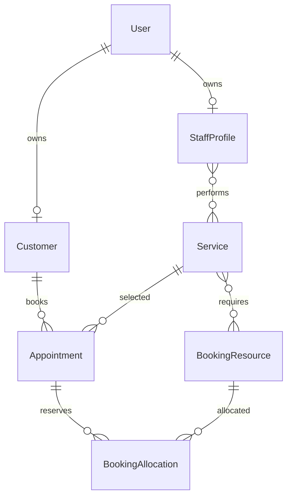

# Database

## 1. Purpose

This document defines the approved PostgreSQL and Prisma data-model direction for Estetica Plus.

It covers:

- data ownership;
- naming and migration rules;
- core entities and relationships;
- services, translations, prices, and images;
- customers, users, staff, rooms, and devices;
- schedules and appointments;
- database-level booking conflict protection;
- seed and backup requirements.

The exact `schema.prisma` file is created during implementation. This document remains the source of truth for its behavior.

## 2. Approved Technology and Ownership

- PostgreSQL 16 or the supported production version approved at deployment time
- Prisma as the only ORM and migration owner
- NestJS as the only application with Prisma access

Forbidden:

- Prisma inside `apps/web`;
- direct browser database access;
- a second ORM;
- production schema changes outside migrations;
- storing image binaries in PostgreSQL;
- using JavaScript floating-point values as authoritative money.

## 3. General Data Rules

### Identifiers

- use generated opaque primary keys;
- use stable business keys where seed/import identity is required;
- public URLs use slugs, never database IDs as the only meaningful identifier;
- internal relationships use IDs, not slugs or translated names.

### Timestamps

Operational timestamps use timezone-aware database timestamps.

Standard fields where applicable:

```text
createdAt
updatedAt
deletedAt
```

Rules:

- store instants in UTC;
- convert to the studio timezone for display and scheduling;
- do not store a locale-formatted date string as an authoritative timestamp;
- appointment snapshots retain the timezone used for customer communication.

### Soft Deletion and Archiving

Business records referenced by historical appointments are normally archived, not physically deleted.

Examples:

- service;
- staff profile;
- room;
- device;
- customer.

Permanent deletion is reserved for explicitly approved privacy and retention workflows.

### Money

Initial authoritative currency:

```text
EUR
```

Store:

```text
amountMinor: integer
currency: ISO currency code
```

Examples:

```text
€25.00  → 2500
€155.00 → 15500
```

Use exact database decimal only if a future calculation genuinely cannot use minor units.

## 4. Naming

Prisma models use clear singular `PascalCase` names.

Application fields use `camelCase`.

Database table and column naming is mapped consistently during schema implementation. Do not mix naming strategies ad hoc.

Boolean fields start with:

```text
is
has
can
requires
```

Timestamp fields end with:

```text
At
```

## 5. Core Entity Map



The detailed model is divided into identity, content, booking, and operational areas below.

## 6. Identity and Customer Data

### 6.1 User

A `User` is an authenticated account.

Core fields:

```text
id
email
emailNormalized
passwordHash
role
isActive
emailVerifiedAt
lastLoginAt
createdAt
updatedAt
```

Rules:

- normalized email is unique when present;
- password hashes are never returned;
- role changes are audited;
- deactivation blocks new sessions;
- a user may be linked to a customer or staff profile.

Roles:

```text
CUSTOMER
STAFF
ADMIN
SUPER_ADMIN
```

### 6.2 Customer

A `Customer` represents the studio relationship and appointment history. It may exist before an authenticated account.

Core fields:

```text
id
userId?
firstName
lastName
email?
emailNormalized?
phone?
phoneNormalized?
preferredLocale
marketingConsentAt?
privacyConsentAt?
isActive
createdAt
updatedAt
```

Why `Customer` is separate from `User`:

- guest booking is allowed;
- appointment history can exist before registration;
- a customer can later create an account;
- authentication data remains separate from studio/customer data.

Rules:

- do not automatically merge customers only because unverified contact fields look similar;
- linking previous guest appointments requires verified control of the relevant email or phone;
- merge operations are authorized, auditable, and reversible where practical;
- collect only information required for studio operations.

### 6.3 RefreshSession

Stores revocable refresh-token session metadata.

Core fields:

```text
id
userId
tokenHash
familyId
expiresAt
rotatedAt?
revokedAt?
replacedBySessionId?
userAgentSummary?
ipAddressHash?
createdAt
lastUsedAt?
```

Raw refresh tokens are never stored.

### 6.4 Verification and Reset Tokens

Email-verification and password-reset tokens use dedicated records:

```text
tokenHash
userId
expiresAt
usedAt?
createdAt
```

Raw tokens are sent to the user and not persisted.

## 7. Staff

### 7.1 StaffProfile

Core fields:

```text
id
userId?
displayName
bioBg?
bioEn?
photoId?
isActive
acceptsOnlineBookings
sortOrder
createdAt
updatedAt
```

Current seed:

- one active cosmetician;
- capable of the approved services;
- linked to one staff booking resource.

The model supports additional specialists later without migration redesign.

### 7.2 StaffService

Many-to-many relationship:

```text
staffProfileId
serviceId
isActive
durationMinMinutesOverride?
durationMaxMinutesOverride?
bookingDurationMinutesOverride?
```

Initial rules:

- multiple staff may perform one service;
- one staff member may perform multiple services;
- service price is shared in phase 1;
- duration defaults come from the service;
- a specialist may override minimum, maximum, and booking duration;
- partial or inconsistent override combinations are rejected;
- effective booking duration is snapshotted on the appointment;
- no staff-specific price override exists in phase 1.

## 8. Content Hierarchy

The admin terminology remains:

```text
Section
Category
Subcategory
Service
```

### 8.1 ServiceSection

Core fields:

```text
id
key
sortOrder
isActive
publicationStatus
heroImageId?
createdAt
updatedAt
```

### 8.2 ServiceSectionTranslation

```text
id
sectionId
locale
name
slug
description?
seoTitle?
seoDescription?
```

Unique:

```text
(sectionId, locale)
(locale, slug)
```

### 8.3 ServiceCategory

```text
id
key
sectionId
sortOrder
isActive
publicationStatus
coverImageId?
createdAt
updatedAt
```

### 8.4 ServiceCategoryTranslation

Localized name, slug, description, and SEO fields with the same uniqueness rules.

### 8.5 ServiceSubcategory

```text
id
key
categoryId
sortOrder
isActive
publicationStatus
createdAt
updatedAt
```

### 8.6 ServiceSubcategoryTranslation

Localized subcategory fields.

Separate translation tables keep BG and EN publication complete and allow future locale expansion without adding many new columns.

## 9. Service

Core operational fields:

```text
id
serviceKey
sectionId
categoryId
subcategoryId?
sortOrder
publicationStatus
isActive
isFeatured
isBookable
requiresConsultation
confirmationMode
durationMinMinutes
durationMaxMinutes
bookingDurationMinutes
priceType
priceAmountMinor?
priceMaxAmountMinor?
priceCurrency?
bookingLeadTimeMinutes?
bookingWindowDays?
cancellationDeadlineHoursOverride?
rescheduleDeadlineHoursOverride?
allowCustomerCancellationOverride?
allowCustomerRescheduleOverride?
createdAt
updatedAt
```

Enums:

```text
PublicationStatus:
DRAFT
PUBLISHED
ARCHIVED

ConfirmationMode:
AUTOMATIC
MANUAL

PriceType:
FIXED
FROM
RANGE
PER_AREA
PER_ITEM
CONSULTATION_REQUIRED
```

Validation constraints:

- duration fields are positive;
- minimum duration does not exceed maximum duration;
- booking duration is not shorter than the minimum;
- booking duration includes every operational minute that must block the calendar;
- range price requires both amounts;
- maximum price is not lower than minimum price;
- bookable service requires complete operational data;
- archived service cannot be offered for new bookings.

### 9.1 ServiceTranslation

```text
id
serviceId
locale
name
slug
shortDescription?
fullDescription?
benefits?
suitableFor?
treatmentProcess?
preparation?
aftercare?
contraindications?
recoveryInformation?
customerInstructions?
seoTitle?
seoDescription?
publicationStatus
createdAt
updatedAt
```

Unique:

```text
(serviceId, locale)
(locale, slug)
```

### 9.2 Service Image Relationships

Separate relationships identify:

- cover image;
- gallery images;
- before-and-after pairs;
- ordering.

## 10. Media

### 10.1 MediaAsset

```text
id
cloudinaryPublicId
resourceType
format?
width
height
bytes?
focalPointX?
focalPointY?
altBg?
altEn?
captionBg?
captionEn?
isActive
publicationStatus
createdAt
updatedAt
```

Rules:

- `cloudinaryPublicId` is unique;
- transformed URLs are constructed at render time;
- image binary is not stored in PostgreSQL;
- an asset is not physically removed while referenced;
- upload and deletion actions are audited.

### 10.2 Gallery

```text
id
key
titleBg?
titleEn?
descriptionBg?
descriptionEn?
publicationStatus
sortOrder
createdAt
updatedAt
```

### 10.3 GalleryItem

```text
galleryId
mediaAssetId
sortOrder
```

### 10.4 BeforeAfterPair

```text
id
serviceId?
beforeMediaId
afterMediaId
labelBg?
labelEn?
sortOrder
consentConfirmedAt
publicationStatus
```

## 11. Booking Resources

`BookingResource` represents anything whose time cannot overlap.

Types:

```text
STAFF
ROOM
DEVICE
```

Core fields:

```text
id
type
key
name
isActive
capacity
createdAt
updatedAt
```

Initial resources:

- one staff resource for the cosmetician;
- one room resource named `Основен кабинет`;
- one resource for each limited device that participates in availability.

This model allows more staff, rooms, and devices later.

### 11.1 Staff Resource

Each active bookable staff member has one linked `BookingResource` of type `STAFF`.

### 11.2 Room Resource

The current studio has one room. The room remains a real resource so adding more rooms later does not require redesign.

### 11.3 Device Resource

Limited devices such as the RF device are resources. A service may require one or more device resources.

### 11.4 ServiceRequiredResource

```text
serviceId
resourceId
isRequired
```

It identifies the room/device requirements used by availability.

Staff eligibility remains in `StaffService`.

## 12. Working Schedule

### 12.1 WeeklyWorkingRule

Represents recurring weekly availability:

```text
id
resourceId
dayOfWeek
startLocalTime
endLocalTime
validFrom?
validUntil?
isActive
```

Primarily used for staff. Room/device schedules may be added when operationally needed.

### 12.2 ScheduleException

Represents a specific-date override:

```text
id
resourceId?
date
startLocalTime?
endLocalTime?
type
reason?
isAvailable
createdAt
updatedAt
```

Types may include:

```text
BREAK
BLOCKED
LEAVE
HOLIDAY
EXTRA_WORKING_TIME
```

Rules:

- date-specific exceptions override recurring rules;
- a full-day closure may omit start/end time;
- partial breaks include a range;
- admin changes are validated against existing appointments;
- changing availability never silently cancels an appointment.

## 13. Studio Settings and Policies

### 13.1 StudioSettings

Single active settings record or versioned settings model:

```text
timezone
defaultLocale
defaultCurrency
defaultConfirmationMode
cancellationDeadlineHours
rescheduleDeadlineHours
allowCustomerCancellation
allowCustomerReschedule
guestBookingEnabled
updatedAt
```

Approved defaults:

```text
defaultConfirmationMode: AUTOMATIC
cancellationDeadlineHours: 24
rescheduleDeadlineHours: 24
allowCustomerCancellation: true
allowCustomerReschedule: true
guestBookingEnabled: true
```

Service overrides apply only when explicitly set.

## 14. Appointment

### 14.1 Core Fields

```text
id
referenceCode
customerId
userId?
serviceId
staffProfileId
status
confirmationModeSnapshot
startsAt
endsAt
timezone
priceTypeSnapshot
priceAmountMinorSnapshot?
priceMaxAmountMinorSnapshot?
priceCurrencySnapshot?
serviceNameSnapshot
durationMinMinutesSnapshot
durationMaxMinutesSnapshot
bookingDurationMinutesSnapshot
cancellationDeadlineHoursSnapshot
rescheduleDeadlineHoursSnapshot
allowCustomerCancellationSnapshot
allowCustomerRescheduleSnapshot
customerFirstNameSnapshot
customerLastNameSnapshot
customerEmailSnapshot?
customerPhoneSnapshot?
customerNotes?
internalNotes?
confirmedAt?
cancelledAt?
completedAt?
createdAt
updatedAt
```

Snapshots preserve the rules and customer-visible meaning at booking time.

### 14.2 Status

Initial status enum:

```text
PENDING
CONFIRMED
CANCELLED_BY_CUSTOMER
CANCELLED_BY_STAFF
COMPLETED
NO_SHOW
```

Rules:

- automatic-confirmation service creates `CONFIRMED`;
- manual-confirmation service creates `PENDING`;
- transitions are validated;
- cancelled/completed/no-show appointments do not return to active status without a documented admin correction flow;
- status changes are recorded in history.

### 14.3 AppointmentStatusHistory

```text
id
appointmentId
fromStatus?
toStatus
changedByUserId?
reason?
createdAt
```

## 15. BookingHold and BookingAllocation

### 15.1 BookingHold

A `BookingHold` temporarily owns the selected resources while the customer completes the details form.

Core fields:

```text
id
publicReference
holdTokenHash
serviceId
staffProfileId
startsAt
endsAt
expiresAt
status
convertedAppointmentId?
releasedAt?
createdAt
updatedAt
```

Statuses:

```text
ACTIVE
CONVERTED
EXPIRED
RELEASED
```

Rules:

- expiry is 10 minutes from successful hold creation;
- the hold starts after slot selection and the customer clicks “Continue”;
- raw hold tokens are not stored;
- expired or released holds cannot be converted;
- conversion is idempotent and creates at most one appointment;
- a hold is not customer history;
- no payment is associated with a hold in phase 1.

### 15.2 BookingAllocation

Every active hold and appointment reserves each required resource through `BookingAllocation`.

Core fields:

```text
id
appointmentId?
bookingHoldId?
resourceId
startsAt
endsAt
isActive
createdAt
```

Exactly one of `appointmentId` or `bookingHoldId` must be present. This XOR rule is enforced by database constraint.

A hold or appointment normally allocates:

- one staff resource;
- one room resource;
- required device resources.

### Database Conflict Protection

PostgreSQL must reject overlapping active allocations for the same resource.

Conceptual rule:

```text
same resource
AND active allocation
AND time ranges overlap
→ reject
```

This is implemented with PostgreSQL range/exclusion behavior through a reviewed custom SQL migration when necessary.

The application still checks availability for user experience, but the database is the final concurrency authority. Expired holds have their allocations released by an idempotent scheduled cleanup and by the approved request-time locking strategy. A browser timer is never authoritative.

## 16. Hold and Booking Transactions

Hold creation occurs in one transaction:

1. validate service, selected start, and eligible specialist;
2. resolve effective specialist duration and required resources;
3. calculate the complete blocked interval using `bookingDurationMinutes`;
4. validate working rules and exceptions;
5. release relevant expired holds according to the approved locking strategy;
6. create a 10-minute hold and all resource allocations;
7. allow PostgreSQL constraints to reject overlaps;
8. return only the opaque raw token and safe expiry data.

Appointment creation from a hold occurs in one transaction:

1. hash and lock the hold token record;
2. validate `ACTIVE` status and server-side expiry;
3. validate customer/contact and current service state;
4. create appointment snapshots using the held specialist and effective duration;
5. transfer or replace hold allocations with appointment allocations atomically;
6. mark the hold `CONVERTED` and link the appointment;
7. create status history;
8. create notification/outbox records.

If any required step fails, no partial appointment remains.

Explicit release and scheduled expiry are also transactional and idempotent.

## 17. Guest Booking and Account Linking

Guest booking creates or associates a `Customer` and creates an appointment without requiring `User`.

After booking:

- offer account creation on the success page;
- offer it in the confirmation email;
- allow a later registration flow;
- avoid repeated prompts during one session.

Previous appointments are linked to the new account only after verified control of the relevant contact channel.

Do not silently expose appointment history based only on entered email or phone.

## 18. Cancellation and Rescheduling

Approved defaults:

```text
cancellationDeadlineHours: 24
rescheduleDeadlineHours: 24
```

Rules:

- admin may update global settings;
- service may override the defaults;
- appointment stores policy snapshots;
- customer self-service checks the appointment snapshot;
- staff/admin can make authorized exceptions;
- rescheduling replaces allocations transactionally;
- failed rescheduling leaves the original appointment unchanged;
- cancellation releases active allocations;
- cancellation is recorded in status history.

## 19. Reviews

### Review

```text
id
customerId?
appointmentId?
displayName
rating
body
locale
moderationStatus
isFeatured
publishedAt?
createdAt
updatedAt
```

Enums:

```text
PENDING
APPROVED
REJECTED
```

Constraints:

- rating from 1 to 5;
- public queries return approved reviews only;
- verified-appointment state is derived from the relationship, not client input.

## 20. Notifications and Outbox

### Notification

```text
id
appointmentId?
userId?
customerId?
type
channel
locale
status
scheduledFor?
sentAt?
attemptCount
lastErrorCode?
createdAt
updatedAt
```

### Outbox Direction

Critical database changes and notification intents are recorded transactionally. Delivery happens after commit.

This prevents an email-provider failure from corrupting appointment creation.

Raw provider errors containing sensitive data are not stored.

## 21. Audit Log

Sensitive admin actions require an audit record:

```text
id
actorUserId?
action
entityType
entityId
safeMetadata?
requestId?
createdAt
```

Examples:

- role changes;
- appointment override;
- service publication;
- customer merge;
- media deletion;
- policy change.

Audit logs must not contain passwords, raw tokens, or unnecessary personal data.

## 22. Indexes

Required index categories:

- normalized unique email;
- foreign-key access paths;
- service publication and ordering;
- locale and slug uniqueness;
- appointment start time and status;
- customer appointment history;
- staff schedule queries;
- resource allocation time queries;
- active/expiring hold status and expiry;
- unique hold-token hash;
- notification status and schedule;
- refresh-session user and expiry;
- audit entity and timestamp.

Indexes are justified by real query patterns and verified with production-like data.

## 23. Constraints

Use database constraints for:

- unique normalized identity values;
- unique stable keys;
- unique localized slugs;
- valid duration relationships;
- valid specialist duration override relationships;
- exactly one allocation owner: appointment or hold;
- one successful appointment conversion per hold;
- valid price relationships;
- rating range;
- non-negative monetary and buffer values;
- non-empty allocation ranges;
- non-overlapping active booking allocations;
- one translation per entity and locale.

Application validation improves messages but does not replace database integrity.

## 24. Prisma Migrations

Workflow:

1. update `schema.prisma`;
2. generate a named development migration;
3. review generated SQL;
4. add reviewed custom SQL when required;
5. test migration on a disposable database;
6. test application and seed;
7. commit schema and migration together;
8. apply production migration through deployment.

Rules:

- do not edit a migration already applied to shared environments;
- do not use development migration commands in production;
- back up before material production migrations;
- plan data backfills explicitly;
- destructive changes require approval and rollback/recovery planning.

## 25. Seed Data

Seed sources:

- normalized Estetica Plus workbook;
- approved initial studio settings;
- initial staff member;
- initial room;
- required device resources;
- roles and technical reference values.

Rules:

- seed by stable keys;
- use upsert or equivalent idempotent behavior where safe;
- do not duplicate services on rerun;
- do not publish incomplete content automatically;
- report `needsReview`;
- do not create production admin passwords in source code;
- environment-specific bootstrap credentials use a secure operational flow.

The workbook currently contains:

- 76 services;
- 75 initially bookable services;
- one service requiring price and duration review.

## 26. Data Retention and Privacy

Retention periods are finalized in `docs/13-security.md`.

Direction:

- keep only data required for legal, booking, customer-service, and security needs;
- distinguish account deletion from legally required appointment retention;
- anonymize where deletion is appropriate;
- preserve audit integrity without retaining excessive personal data;
- never use production customer data in development or tests.

## 27. Backups

Production requires:

- automated nightly PostgreSQL backups;
- offsite storage;
- restricted access;
- retention rotation;
- failure monitoring;
- documented restoration;
- periodic restore test;
- backup before high-risk migrations.

A backup is not considered reliable until restoration is tested.

## 28. Testing Requirements

Database testing includes:

- migration from empty database;
- seed rerun;
- unique slug constraints;
- price and duration constraints;
- transaction rollback;
- simultaneous booking attempts;
- staff/room/device overlap rejection;
- cancelled appointment allocation release;
- reschedule rollback;
- customer account-link verification;
- policy snapshots;
- backup restoration procedure.

## 29. Deferred Features

Not included in phase 1:

- payments and deposits;
- staff-specific prices;
- memberships and packages;
- loyalty points;
- multiple studio locations;
- resource capacity greater than one;
- waitlist.

Optional online prepayment through Stripe is a possible future feature, not an implemented or configured phase-1 dependency.

The model must not claim these features exist, but should avoid blocking sensible future additions.

## 30. Definition of Done

The database implementation is complete when:

- Prisma is the only ORM;
- all migrations are reviewed and reproducible;
- seed runs without duplicates;
- money remains exact;
- BG/EN translations are constrained correctly;
- historical appointments preserve snapshots;
- staff, room, and device overlaps are rejected by PostgreSQL;
- guest history cannot be exposed without verification;
- cancellation/reschedule policies are snapshotted;
- tests cover transactions and concurrency;
- backups and restore procedures are documented.

## 31. Official References

- [Prisma indexes](https://www.prisma.io/docs/orm/prisma-schema/data-model/indexes)
- [Prisma transactions](https://www.prisma.io/docs/orm/prisma-client/queries/transactions)
- [Customizing Prisma migrations](https://www.prisma.io/docs/orm/prisma-migrate/workflows/customizing-migrations)
- [Prisma raw queries](https://www.prisma.io/docs/orm/prisma-client/using-raw-sql/raw-queries)
- [PostgreSQL range types](https://www.postgresql.org/docs/current/rangetypes.html)
- [PostgreSQL constraints](https://www.postgresql.org/docs/current/ddl-constraints.html)
