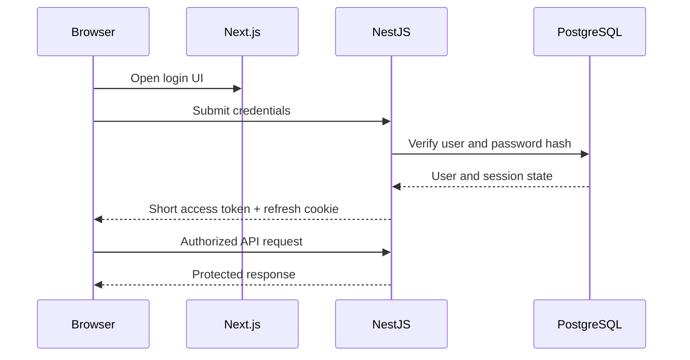

# Authentication and Authorization

## 1. Purpose

This document defines authentication, session management, account recovery, roles, and authorization for Estetica Plus.

NestJS is the authentication authority.

Next.js provides login and account UI but does not independently validate credentials or grant access.

## 2. Goals

- secure customer, staff, and admin accounts;
- allow guest booking without forced registration;
- link verified historical appointments after registration;
- support revocable sessions;
- avoid browser token persistence in `localStorage`;
- protect admin functions with server-side authorization;
- provide safe password reset and account recovery;
- keep the initial customer experience simple.

## 3. Roles

```text
CUSTOMER
STAFF
ADMIN
SUPER_ADMIN
```

### CUSTOMER

May:

- manage own account;
- view own linked appointments;
- cancel or reschedule own eligible appointments;
- review own eligible completed appointment when allowed.

May not:

- view another customer;
- change appointment policy;
- change authoritative appointment status;
- access admin content.

### STAFF

May:

- view permitted schedule information;
- view appointment information required for work;
- perform explicitly allowed operational actions.

Staff access is minimized. A staff role does not automatically grant full customer-database access.

### ADMIN

May manage approved:

- services and content;
- staff and schedules;
- appointments;
- reviews;
- media;
- studio settings.

### SUPER_ADMIN

Reserved for sensitive actions such as:

- role assignment;
- administrator management;
- security-sensitive configuration;
- selected destructive or recovery operations.

Do not use `SUPER_ADMIN` for normal daily studio work.

## 4. Authentication Architecture



NestJS:

- verifies credentials;
- creates and revokes sessions;
- issues tokens;
- enforces Guards and ownership;
- stores only token hashes where persistence is required.

Next.js:

- renders forms and protected application shells;
- keeps short-lived access state only in memory;
- initiates refresh when needed;
- redirects for user experience;
- never replaces NestJS authorization.

## 5. Token Strategy

### 5.1 Access Token

Properties:

- short-lived;
- signed;
- contains minimal identity claims;
- sent to NestJS in the authorization header;
- stored in browser memory only;
- never stored in `localStorage` or readable persistent browser storage.

Initial expiry direction:

```text
approximately 10–15 minutes
```

Exact value is environment configuration and security-reviewed.

Minimal claims:

```text
sub
role
sessionId
issuedAt
expiresAt
```

Do not place sensitive profile or appointment data inside the token.

### 5.2 Refresh Token

Properties:

- longer-lived;
- opaque or securely generated;
- delivered in an `HttpOnly` cookie;
- `Secure` in production;
- controlled `SameSite`;
- narrow path/domain scope;
- rotated on successful refresh;
- represented in PostgreSQL only by a secure hash;
- revocable.

Initial session lifetime direction:

```text
approximately 14–30 days
```

The final value may differ for customer and admin risk levels.

### 5.3 Refresh Cookie

Recommended production direction:

- host-only cookie for the API host where practical;
- `HttpOnly`;
- `Secure`;
- explicit `SameSite`;
- narrow path such as the refresh/session route when compatible;
- no application data in the cookie value.

Cookie behavior must be tested through the actual Nginx, domain, and browser setup.

## 6. Session Rotation and Reuse Detection

Each refresh creates a new session/token record and invalidates the previous refresh token.

If an already rotated token is presented:

- treat it as potential token theft;
- revoke the affected token family;
- require login again;
- record a safe security event;
- do not expose internal detection details to the client.

Session records allow:

- current-device logout;
- logout from all devices;
- password-change revocation;
- admin security revocation;
- expired-session cleanup.

## 7. Registration

### 7.1 Customer Registration

Required fields:

- email;
- password;
- password confirmation;
- required policy acceptance;
- optional profile fields only when useful.

Flow:

1. validate input;
2. prevent unsafe account enumeration;
3. create inactive/unverified or limited account state;
4. send email verification;
5. verify token;
6. link eligible customer record and appointments;
7. establish a normal login session.

### 7.2 Registration After Guest Booking

Prompts may appear:

- on booking success;
- in confirmation email;
- on a later booking.

Rules:

- do not interrupt successful booking;
- do not repeat multiple prompts in one session;
- prefill verified-safe contact information where appropriate;
- previous appointments appear only after email/phone ownership verification;
- ambiguous customer matches require a safe resolution flow.

### 7.3 Staff and Admin Accounts

Public registration cannot create:

- `STAFF`;
- `ADMIN`;
- `SUPER_ADMIN`.

These accounts are created or promoted only through an authorized administrative process and audited.

## 8. Login

Login accepts:

- normalized email;
- password.

Flow:

1. validate format;
2. apply rate limiting and abuse detection;
3. locate active account;
4. verify password hash using a maintained password-hashing library;
5. verify account state;
6. create refresh session;
7. return short access token;
8. set refresh cookie;
9. update safe last-login metadata.

Error messages must not unnecessarily reveal whether the account exists.

Example:

```text
Incorrect email or password.
```

## 9. Password Policy

Direction:

- permit long passwords/passphrases;
- do not silently truncate;
- support spaces and Unicode;
- do not require arbitrary combinations of uppercase, number, and symbol as the only strength rule;
- reject known compromised passwords if an approved privacy-safe mechanism is added;
- allow password managers and paste;
- never email or log a password.

Initial minimum:

```text
12 characters
```

Maximum length must be high enough for passphrases while protecting the hashing endpoint from abuse.

## 10. Password Storage

Use a maintained password-hashing implementation and a modern password-hashing algorithm such as Argon2id when supported by the chosen library and deployment environment.

Rules:

- unique salt handled correctly by the library;
- production-calibrated work parameters;
- rehash on login when parameters become outdated;
- no reversible password encryption;
- no custom cryptography;
- never store password hints.

Hashing parameters are documented in secure operational configuration, not scattered through controllers.

## 11. Email Verification

Verification token requirements:

- cryptographically random;
- sufficiently long;
- single use;
- short expiry;
- linked to one user;
- stored only as a hash;
- invalidated after use;
- generated URLs use an allowlisted application base URL.

Resending verification:

- is rate-limited;
- does not leak account existence;
- invalidates or safely manages old tokens;
- sends a neutral response.

## 12. Forgot Password

Request flow:

1. accept email;
2. always return a neutral response;
3. apply rate limiting;
4. if eligible, create a single-use random reset token;
5. store only its hash;
6. send an HTTPS reset URL.

Example response:

```text
If an account exists for this email, password-reset instructions will be sent.
```

Reset flow:

1. validate token and expiry;
2. accept and confirm the new password;
3. enforce password policy;
4. update password hash;
5. mark token used;
6. revoke existing sessions by default or according to approved policy;
7. notify the user of the password change;
8. require normal login.

Do not automatically log the user in after password reset.

## 13. Change Password

Authenticated change requires:

- current password;
- new password;
- confirmation;
- recent valid session.

After change:

- revoke other sessions;
- optionally preserve the current session through a documented safe flow;
- send a security notification;
- record an audit/security event.

## 14. Logout

### Current Session

- revoke the current refresh session;
- clear refresh cookie using matching attributes;
- clear in-memory access token;
- return an idempotent success response.

### All Sessions

- revoke all active refresh sessions for the user;
- clear current cookie;
- require login on all devices.

Logout does not rely only on deleting the browser cookie; server session revocation is required.

## 15. Access-Token Refresh

Flow:

1. browser sends refresh cookie to NestJS;
2. verify CSRF/origin policy;
3. hash and locate token;
4. validate expiry, revocation, user, and token family;
5. rotate refresh session;
6. set replacement cookie;
7. return new short-lived access token.

Concurrent refresh requests must not accidentally create multiple valid successors. The implementation needs transaction or atomic-update protection.

## 16. Frontend Session Behavior

Because access tokens live in memory:

- a page reload may require a refresh call;
- the application shows a short neutral session-loading state;
- failed refresh leads to logged-out state;
- protected customer/admin content is not rendered from a public cache;
- failed API calls may trigger one controlled refresh-and-retry attempt;
- avoid infinite refresh loops.

Next.js middleware may improve redirects only when it has a safe non-authoritative signal. It must not be treated as the security boundary.

## 17. Authorization

Authentication answers:

```text
Who is the user?
```

Authorization answers:

```text
May this user perform this action on this resource?
```

Both are required.

### Guards

NestJS Guards enforce:

- authenticated access;
- role requirements;
- selected permission requirements.

### Ownership

Application services enforce resource-level checks:

- customer may access own appointments only;
- staff may access permitted schedule/customer data only;
- admin actions follow role and scope;
- only super admin may manage privileged roles.

Never trust:

- user ID from request body;
- role from the client;
- appointment ownership from URL alone;
- hidden frontend buttons as authorization.

## 18. Permission Direction

Start with roles plus explicit resource ownership.

Do not introduce a complex permission framework before real requirements exist.

Potential permission examples:

```text
services.read
services.write
appointments.read
appointments.manage
staff.manage
reviews.moderate
media.manage
roles.manage
```

If role needs become more granular, add permissions through an approved migration rather than scattered conditionals.

## 19. Guest Booking Security

Guest booking requires:

- name;
- contact channel;
- required privacy acceptance;
- rate limiting;
- server-side validation;
- booking-abuse protections.

Guest appointment management must not rely on a guessable reference code alone.

Possible secure access:

- authenticated linked account; or
- time-limited, single-purpose signed management link sent to the verified contact channel.

The final guest-management flow is completed in `docs/08-booking-engine.md`.

## 20. Appointment History Linking

When a customer registers:

1. verify email or phone;
2. find eligible unlinked customer/appointment records;
3. detect ambiguity;
4. link only verified matches;
5. record the linking event;
6. prevent access to records belonging to another person.

Do not automatically link solely from a newly typed, unverified email address.

## 21. CSRF

Bearer-token API requests are sent through an authorization header and are not authenticated solely by ambient cookies.

Cookie-based endpoints such as:

- refresh;
- logout;
- selected session operations

require CSRF protection appropriate to the final deployment.

Direction:

- explicit allowed-origin validation;
- appropriate `SameSite`;
- CSRF token strategy when required;
- no state change through `GET`;
- CORS restricted to approved origins.

`SameSite` alone is not treated as the complete documented defense.

## 22. Rate Limiting and Abuse Protection

Apply stricter controls to:

- login;
- registration;
- email-verification resend;
- forgot password;
- reset password;
- refresh;
- guest booking;
- guest appointment-management links.

Use:

- per-IP controls;
- per-account/contact controls where safe;
- increasing delay or temporary restriction;
- generic errors;
- security logging;
- optional CAPTCHA only after justified abuse signals.

Rate limiting must account for the trusted Nginx proxy configuration.

## 23. MFA Direction

Phase 1:

- customer MFA is not required;
- architecture does not claim MFA exists.

Recommended later:

- require or strongly support MFA for `SUPER_ADMIN`;
- consider MFA for `ADMIN`;
- use standards-based authenticator or passkey approaches rather than SMS as the preferred method.

Adding MFA requires an ADR and recovery design.

## 24. Account State

Supported direction:

```text
PENDING_VERIFICATION
ACTIVE
LOCKED
DISABLED
```

Rules:

- disabled users cannot refresh or log in;
- administrative disable revokes sessions;
- lock behavior protects against abuse without enabling denial-of-service through trivial repeated attempts;
- status changes are audited.

## 25. Security Events

Record safe events for:

- successful and failed login summaries;
- password reset request and completion;
- password change;
- session revocation;
- refresh-token reuse detection;
- role change;
- account disable/enable;
- customer-history linking.

Do not record raw credentials or tokens.

## 26. Admin Account Bootstrap

Never commit a default production admin password.

Approved direction:

- secure one-time operational bootstrap;
- environment-provided initial identity or controlled CLI process;
- forced verification/password setup;
- immediate removal or disabling of bootstrap capability;
- audit record.

The exact deployment procedure belongs in `docs/10-deployment.md`.

## 27. API Endpoint Direction

Example:

```text
POST /api/v1/auth/register
POST /api/v1/auth/login
POST /api/v1/auth/refresh
POST /api/v1/auth/logout
POST /api/v1/auth/logout-all
POST /api/v1/auth/verify-email
POST /api/v1/auth/resend-verification
POST /api/v1/auth/forgot-password
POST /api/v1/auth/reset-password
POST /api/v1/auth/change-password
GET  /api/v1/auth/me
GET  /api/v1/auth/sessions
DELETE /api/v1/auth/sessions/:id
```

Final paths must match OpenAPI and implementation.

## 28. Response Rules

Authentication responses:

- contain no password hash;
- contain no raw refresh token in JSON when cookie delivery is used;
- expose only required account/profile fields;
- use generic credential and recovery errors;
- distinguish unauthenticated, forbidden, locked, and validation states safely;
- include correlation/request ID through the standard error model.

## 29. Personal Data

Authentication and profiles must minimize collected data.

Rules:

- do not store unnecessary identity documents;
- do not place sensitive personal data in JWTs;
- do not log full contact details unnecessarily;
- restrict staff access to customer data;
- document retention and deletion;
- separate marketing consent from required service/privacy acceptance;
- never make marketing consent a requirement for booking.

Detailed policy belongs in `docs/13-security.md`.

## 30. Testing

Required tests:

- registration validation;
- duplicate normalized email;
- email verification expiry and single use;
- correct and incorrect login;
- inactive/disabled account;
- refresh rotation;
- concurrent refresh;
- refresh-token reuse detection;
- current and all-session logout;
- reset-token expiry and single use;
- password-change session revocation;
- role Guards;
- appointment ownership;
- staff access boundaries;
- admin versus super-admin actions;
- guest-history linking after verification;
- CSRF/origin rejection;
- rate-limit behavior.

## 31. Configuration

Configurable values:

```text
access-token expiry
refresh-session expiry
email-verification expiry
password-reset expiry
cookie name
cookie domain
cookie path
SameSite mode
allowed origins
password-hash parameters
rate limits
trusted application URLs
```

Production startup fails when required secrets or trusted URLs are missing.

Secrets are rotated through an operational plan. Token-signing rotation must support a safe transition when needed.

## 32. Definition of Done

Auth is complete when:

- NestJS is the sole authentication authority;
- refresh tokens are hashed and rotating;
- access tokens are short-lived and not persistently browser-readable;
- cookies use secure production attributes;
- password and reset flows follow approved security practices;
- customer, staff, admin, and super-admin boundaries are tested;
- ownership is enforced server-side;
- guest appointments link only after verification;
- sessions can be listed and revoked;
- auth endpoints are rate-limited;
- CSRF/origin protections are tested;
- no raw credential or token appears in logs.

## 33. Official Security References

- [NestJS authentication](https://docs.nestjs.com/security/authentication)
- [NestJS authorization](https://docs.nestjs.com/security/authorization)
- [OWASP Authentication Cheat Sheet](https://cheatsheetseries.owasp.org/cheatsheets/Authentication_Cheat_Sheet.html)
- [OWASP Password Storage Cheat Sheet](https://cheatsheetseries.owasp.org/cheatsheets/Password_Storage_Cheat_Sheet.html)
- [OWASP Session Management Cheat Sheet](https://cheatsheetseries.owasp.org/cheatsheets/Session_Management_Cheat_Sheet.html)
- [OWASP Forgot Password Cheat Sheet](https://cheatsheetseries.owasp.org/cheatsheets/Forgot_Password_Cheat_Sheet.html)
- [OWASP CSRF Prevention Cheat Sheet](https://cheatsheetseries.owasp.org/cheatsheets/Cross-Site_Request_Forgery_Prevention_Cheat_Sheet.html)
