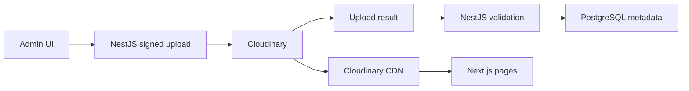

# Images

## 1. Purpose

This document defines how Estetica Plus uploads, stores, manages, transforms, delivers, and removes images.

The system is designed for:

- homepage hero photography;
- service covers and galleries;
- before-and-after results;
- staff and studio photography;
- marketing content;
- hundreds or thousands of assets over time;
- fast delivery on mobile and desktop;
- BG and EN accessibility and SEO;
- replacement of visual content without code changes.

Cloudinary stores and delivers the image files. PostgreSQL stores the application metadata and Cloudinary identifiers. The VPS does not serve the production image library.

## 2. Approved Architecture



Responsibilities:

### Next.js

- renders responsive images;
- requests only the required transformed size;
- uses the localized alternative text;
- respects the stored focal point;
- does not contain the Cloudinary API secret;
- provides the custom media administration UI.

### NestJS

- authenticates and authorizes administrators;
- creates short-lived signed upload parameters;
- validates completed upload results;
- creates and updates `MediaAsset` records;
- controls deletion and replacement;
- records sensitive media actions in the audit log.

### Cloudinary

- stores originals;
- generates transformed variants;
- selects an efficient delivery format and quality;
- delivers through its CDN;
- keeps image bytes outside the VPS and PostgreSQL.

### PostgreSQL

- stores `cloudinaryPublicId` and metadata;
- stores BG and EN alternative text and captions;
- stores publication, consent, focal-point, and relationship data;
- never stores the image binary or a permanent transformed URL.

## 3. Core Rule

Store:

```text
cloudinaryPublicId
resourceType
format
width
height
bytes
focalPointX
focalPointY
altBg
altEn
captionBg
captionEn
publicationStatus
```

Do not store a generated delivery URL as the authoritative reference.

Transformation URLs are constructed from the public ID and a controlled transformation preset at render time.

## 4. Asset Roles

Initial roles:

```text
HOMEPAGE_HERO
SERVICE_COVER
SERVICE_GALLERY
BEFORE
AFTER
CATEGORY_COVER
STAFF_PROFILE
STUDIO
MARKETING
SEO_SOCIAL
```

One physical image may be reused in more than one relationship where that is intentional. Roles and ordering belong to database relationships, not only Cloudinary folders.

## 5. Folder and Naming Convention

Suggested Cloudinary root:

```text
estetica-plus/
```

Suggested folders:

```text
estetica-plus/home/
estetica-plus/services/
estetica-plus/before-after/
estetica-plus/staff/
estetica-plus/studio/
estetica-plus/marketing/
estetica-plus/temporary/
```

Rules:

- use stable, non-translated public IDs;
- do not put customer names, email addresses, phone numbers, or medical details in public IDs;
- do not use the Bulgarian or English title as the only asset identity;
- do not depend on folder names for authorization;
- an asset rename is an explicit administrative operation;
- temporary development images are clearly marked and easy to locate.

Example:

```text
estetica-plus/services/hydrafacial/cover-01
```

## 6. Admin Upload Flow

The custom admin panel uses direct signed browser-to-Cloudinary upload.

Flow:

1. admin selects one or more images;
2. the browser performs local pre-validation;
3. Next.js requests signed upload parameters from NestJS;
4. NestJS verifies `ADMIN` or `SUPER_ADMIN`;
5. NestJS returns a short-lived signature and approved upload parameters;
6. the browser uploads directly to Cloudinary over HTTPS;
7. the browser sends the upload result to NestJS;
8. NestJS validates the result and expected folder/type;
9. NestJS creates the `MediaAsset` metadata record;
10. the admin completes alt text, caption, focal point, role, and publication state.

The image file never passes through the VPS application container.

Unsigned public upload presets are not used for the production admin flow.

## 7. Upload Validation

Validation exists in both the browser and NestJS. Browser validation improves the experience; server validation is authoritative.

Initial accepted input formats:

```text
JPEG
PNG
WebP
AVIF where upload tooling supports it reliably
```

HEIC/HEIF may be added only after testing the complete upload and conversion flow.

Initial limits are environment configuration, not hardcoded UI values:

```text
maximum file size
maximum pixel dimensions
allowed MIME types
maximum batch size
```

Reject:

- mismatched extension and MIME type;
- unsupported formats;
- zero-byte or corrupted files;
- files above configured limits;
- unexpected resource types;
- suspicious upload results;
- SVG from ordinary content editors unless a separately secured SVG policy is implemented.

Images should retain sufficient source resolution for their approved use. The admin UI warns when an image is too small for a hero or large editorial placement.

## 8. Upload Status and Failure Recovery

An upload is not considered usable only because Cloudinary received bytes.

Suggested application states:

```text
UPLOADING
PROCESSING
READY
FAILED
ARCHIVED
```

Rules:

- a failed metadata save is recoverable and surfaced to the admin;
- an unreferenced uploaded asset may be cleaned by a scheduled maintenance job after a safe delay;
- a partially completed batch does not pretend all images succeeded;
- retrying metadata creation must be idempotent by Cloudinary public ID;
- public pages use only `READY` and published assets.

## 9. Admin Media Library

The custom admin media area supports:

- grid and list view;
- thumbnail preview;
- upload progress and per-file errors;
- search by public ID, title, caption, service, role, and tag;
- filter by publication state, role, date, and missing metadata;
- BG and EN alternative text;
- BG and EN captions;
- focal-point editor;
- image dimensions and file information;
- service/gallery assignment;
- ordering;
- replace, archive, and safe-delete actions;
- reference count or “used by” view;
- consent state for before-and-after content;
- temporary-placeholder indicator.

Bulk actions may include:

- assign gallery;
- change publication state;
- add internal tag;
- archive;
- reorder within a gallery.

Bulk deletion must never bypass reference and consent checks.

## 10. Responsive Delivery

Next.js requests Cloudinary transformations appropriate to the rendered slot.

General delivery parameters:

```text
f_auto
q_auto
```

Width and crop are controlled by the specific component.

Example width families:

| Use | Candidate widths |
| --- | --- |
| Small thumbnail | 160, 240, 320 |
| Service card | 320, 480, 640, 800 |
| Gallery | 480, 768, 1024, 1440 |
| Hero | 640, 960, 1280, 1600, 1920, 2400 |

These are initial design targets, not a promise that every component loads every width.

Rules:

- provide an accurate `sizes` attribute;
- do not request a 2400 px image for a 360 px mobile slot;
- reserve width and height or aspect ratio to prevent layout shift;
- lazy-load below-the-fold images;
- do not lazy-load the actual LCP hero image;
- do not preload both desktop and mobile hero variants;
- avoid loading full-size originals in lightboxes before the user opens them;
- use pagination or incremental loading for large galleries;
- test transformation usage and Cloudinary quota consumption.

## 11. Transformation Presets

Transformation behavior is centralized in code as named application presets.

Suggested presets:

```text
heroDesktop
heroMobile
serviceCard
serviceCover
galleryGrid
galleryDetail
beforeAfter
staffPortrait
seoSocial
adminThumbnail
blurPlaceholder
```

Each preset defines:

- allowed crop mode;
- width and height behavior;
- quality and format;
- DPR behavior;
- focal-point handling;
- rounding only when part of the component design.

Content editors select semantic usage, not arbitrary Cloudinary transformation strings.

This prevents:

- inconsistent crops;
- unbounded transformation combinations;
- accidental quality loss;
- UI breakage caused by free-form URLs.

## 12. Focal Points and Art Direction

Every hero or important portrait supports:

```text
focalPointX
focalPointY
```

The admin preview displays common desktop, tablet, and mobile crops before publication.

Rules:

- preserve the face and treatment area;
- avoid covering eyes or important details with text or navigation;
- allow a separate mobile asset when one crop cannot serve both layouts;
- changing the focal point does not require a deployment;
- the component provides a safe fallback when no focal point exists.

## 13. Homepage Hero

The homepage hero is editable content rather than hardcoded component copy.

Initial approved content:

```text
headlineBg:
Define Your Own Standard of Beauty

descriptionBg:
Мястото, където грижата и вниманието към детайла се срещат, за да
превърнат твоята визия в твой собствен критерий за красота и увереност.

primaryCtaLabelBg:
Запази своя час
```

Initial English draft:

```text
headlineEn:
Define Your Own Standard of Beauty

descriptionEn:
A place where care and attention to detail come together to transform
your vision into your own standard of beauty and confidence.

primaryCtaLabelEn:
Book an Appointment
```

Editable from the admin panel:

- desktop image;
- optional mobile image;
- BG and EN headline;
- BG and EN supporting text;
- BG and EN CTA label and destination;
- focal point;
- overlay preset;
- publication state.

Development uses a properly licensed temporary image. Production uses the approved photograph of the studio representative or model only after the necessary permission is confirmed.

Changing the hero image, text, button, overlay, or focal point must not require a code change.

## 14. Hero Loading Rules

The active homepage hero is the likely Largest Contentful Paint element.

Requirements:

- render its initial content in server HTML;
- give the active hero high loading priority;
- avoid a client-only carousel as the initial hero;
- provide a low-cost placeholder or background color;
- do not delay visibility until animation JavaScript loads;
- use a controlled overlay to preserve white-text contrast;
- load only the current hero;
- use a mobile-specific crop only when required;
- monitor real mobile LCP after launch.

A future rotating hero must be justified by content needs and performance-tested before adoption.

## 15. Alternative Text and Captions

Alternative text is content, not a filename.

Each meaningful public image supports:

```text
altBg
altEn
```

Rules:

- describe the useful visual information concisely;
- localize meaning rather than mechanically translating word for word;
- do not keyword-stuff;
- decorative images use empty alt text when appropriate;
- linked image purpose must remain understandable;
- before-and-after text identifies the treatment and state without unsupported claims;
- publishing validation warns when required locale alt text is missing.

Captions are optional and separate from alternative text.

## 16. Before-and-After Images

Before-and-after imagery has stricter editorial requirements.

Each pair stores:

```text
beforeMediaId
afterMediaId
serviceId?
labelBg
labelEn
consentConfirmedAt
publicationStatus
sortOrder
```

Rules:

- explicit informed permission is required before public publication;
- consent status is recorded separately from a free-text caption;
- withdrawal triggers prompt unpublication and the approved deletion/retention flow;
- do not expose customer identity or appointment data;
- use comparable angle, crop, distance, and lighting where practical;
- label before and after clearly;
- avoid deceptive retouching and transformations;
- do not use beauty filters that alter the represented result;
- do not promise identical outcomes for future customers;
- preserve the original files for authorized evidence and re-cropping;
- only the approved pair is publicly visible.

The exact consent document and retention period require legal/privacy review before launch.

## 17. Public and Restricted Media

Marketing and published service imagery may use normal public CDN delivery.

Images that contain private customer information, internal documentation, or unapproved treatment results must not be placed in an unrestricted public delivery mode.

Possible classes:

```text
PUBLIC
RESTRICTED
INTERNAL
```

If restricted assets are introduced:

- NestJS authorizes access;
- delivery uses an appropriate authenticated or signed mechanism;
- URLs are short-lived where required;
- the public gallery never receives restricted public IDs;
- caching behavior is security-reviewed.

Phase 1 should avoid storing clinical documentation unless it has a clearly defined purpose, consent basis, access model, and retention policy.

## 18. Replacement, Archive, and Deletion

### Replace

Prefer creating a new asset and changing the relationship when auditability or cache safety matters.

Do not silently replace a before-and-after original while retaining misleading metadata.

### Archive

Archiving:

- removes the image from new editorial selection;
- preserves existing history and references;
- does not immediately destroy the Cloudinary asset.

### Delete

Before physical deletion:

1. authorize the admin action;
2. check every database reference;
3. block deletion or require intentional replacement;
4. record the action;
5. remove or archive the database record consistently;
6. destroy the Cloudinary asset only after the application state is safe;
7. invalidate relevant derived delivery where needed.

Deletion must be idempotent and recoverable where the provider and retention policy allow it.

## 19. SEO and Social Images

SEO image requirements:

- service and content pages select an explicit social image where possible;
- generate consistent Open Graph dimensions from a high-quality source;
- use absolute production delivery URLs in metadata;
- do not use private or draft assets;
- include image width, height, and meaningful alt where supported;
- BG and EN pages may select different imagery or metadata;
- image sitemaps may be introduced if they add measurable discovery value.

The hero image is not automatically the best social image; social crops use a dedicated preset.

## 20. Performance Budgets

Initial acceptance targets:

- no unoptimized original served to a normal public image slot;
- no layout shift caused by missing image dimensions;
- no eager loading of complete galleries;
- hero remains readable before animation hydration;
- gallery pages remain usable on a constrained mobile network;
- admin thumbnails use small transformed images;
- duplicate delivery of the same visual at unnecessary sizes is avoided.

Exact byte targets are established with real photography during implementation because visual complexity changes compression results.

## 21. Security

- Cloudinary API secret exists only in protected server configuration;
- upload signing happens in NestJS;
- signed upload endpoints require admin authorization;
- signatures are short-lived and limited to approved parameters;
- do not accept a client-provided folder, public ID, or transformation without validation;
- validate webhook signatures if webhooks are used;
- rate-limit upload-signature endpoints;
- log administrative create, publish, archive, replace, and delete actions;
- remove metadata that is unnecessary or privacy-sensitive;
- review embedded EXIF/GPS handling before launch;
- never use original filenames as proof of identity or ownership.

## 22. Environment Configuration

Expected configuration names are documented centrally and never committed with secrets.

Conceptual values:

```text
CLOUDINARY_CLOUD_NAME
CLOUDINARY_API_KEY
CLOUDINARY_API_SECRET
CLOUDINARY_UPLOAD_ROOT
CLOUDINARY_SIGNED_UPLOAD_PRESET
MEDIA_MAX_FILE_BYTES
MEDIA_MAX_BATCH_SIZE
```

The public cloud name is not treated as a secret. API secrets are.

## 23. Testing

### Unit

- transformation preset generation;
- focal-point normalization;
- localized alt selection;
- role and publication validation;
- upload-result validation.

### Integration

- admin authorization for upload signing;
- completed upload metadata creation;
- duplicate public-ID handling;
- reference-aware archive and deletion;
- before-and-after consent publication rule.

### UI and End-to-End

- upload success, partial failure, and retry;
- BG and EN alt editing;
- desktop/mobile crop preview;
- hero replacement without deployment;
- responsive `srcset` and `sizes`;
- lazy loading below the fold;
- no layout shift;
- restricted asset is not exposed publicly.

### Performance

- homepage LCP on representative mobile profiles;
- gallery network payload;
- transformation and cache behavior;
- absence of duplicate hero downloads.

## 24. Launch Checklist

- production Cloudinary environment is configured;
- signed uploads work only for authorized admins;
- upload limits and allowed types are configured;
- temporary images are identified;
- production hero permission is confirmed;
- BG and EN alt text is complete for published meaningful images;
- before-and-after consent is confirmed;
- focal points are reviewed on mobile and desktop;
- broken-asset fallback is tested;
- Cloudinary usage alerts are configured;
- privacy and deletion flows are tested;
- Core Web Vitals are measured with production-like photography.

## 25. Decisions Deferred Until Implementation

The following do not block the architecture:

- exact Cloudinary plan;
- final upload byte and pixel limits;
- whether the custom admin uses the Cloudinary Upload Widget or a tailored uploader;
- optional automatic moderation or tagging;
- exact retention period for withdrawn before-and-after originals;
- whether restricted clinical media is needed at all.

These decisions must not change the approved ownership model or expose secrets to Next.js/browser code.

## 26. Official References

- Cloudinary image transformations: <https://cloudinary.com/documentation/image_transformations>
- Cloudinary programmatic uploads: <https://cloudinary.com/documentation/upload_images>
- Cloudinary Upload Widget and signed uploads: <https://cloudinary.com/documentation/upload_widget>
- Cloudinary access control: <https://cloudinary.com/documentation/control_access_to_media>
- Cloudinary contextual metadata: <https://cloudinary.com/documentation/contextual_metadata>

