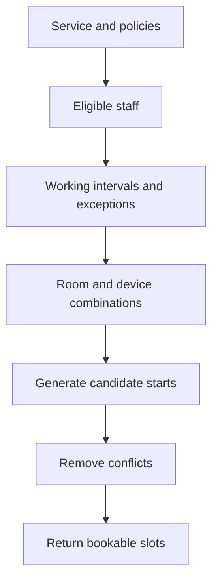

# Booking Engine

## 1. Purpose

This document defines the Estetica Plus appointment-booking rules before the final Prisma schema and implementation are created.

It is the behavioral source of truth for:

- customer slot discovery;
- staff, room, and device availability;
- service defaults and specialist-specific duration overrides;
- 10-minute slot holds;
- automatic and manual confirmation;
- guest and registered booking;
- concurrency and double-booking protection;
- cancellation and rescheduling;
- admin schedule management;
- future expansion to more staff, rooms, and resources.

## 2. Approved Business Decisions

| Question | Approved decision |
| --- | --- |
| Multiple specialists per service | Yes |
| Specialist-specific duration | Yes, through optional `StaffService` overrides |
| Specialist-specific price | Not in phase 1; service price is shared |
| Buffer before/after | No separate buffer; operational time is included in booking duration |
| Rooms | One room now; architecture supports more |
| Devices as resources | Yes |
| Parallel procedures | Yes only when every required resource is free |
| Current operational staff | One cosmetician |
| Confirmation | Automatic by default; selected services may require manual confirmation |
| Temporary slot hold | Yes, 10 minutes after selecting a slot and clicking “Continue” |
| Guest booking | Yes |
| Account encouragement | After booking, by email, and later without blocking booking |
| Customer history | Linked only after verified contact/account association |
| Cancellation/rescheduling | Global 24-hour default, configurable in admin with service overrides |
| Deposit/payment | No in phase 1; optional Stripe prepayment may be evaluated later |
| Schedule exceptions | Breaks, blocked time, leave, holidays, and extra working time |

## 3. Terminology

### Treatment duration

The customer-facing duration range:

```text
durationMinMinutes
durationMaxMinutes
```

Example:

```text
durationMinMinutes: 60
durationMaxMinutes: 80
```

### Booking duration

The treatment time reserved in the calendar:

```text
bookingDurationMinutes: 80
```

This is the complete authoritative interval used for scheduling. It includes preparation, cleanup, turnover, or recovery time when those minutes must block the calendar.

### Blocked interval

The complete interval reserved against resources:

```text
blockedStartsAt = startsAt
blockedEndsAt = startsAt + bookingDurationMinutes
```

An appointment conflicts when its blocked interval overlaps another active allocation for the same resource.

### Slot

A candidate treatment start time that passes all current eligibility, schedule, resource, and policy checks.

A displayed slot is not a reservation.

## 4. Time Model

Studio timezone:

```text
Europe/Sofia
```

Rules:

- weekly schedules and exceptions are entered as studio-local dates and times;
- stored appointment instants use timezone-aware timestamps;
- customer communication includes the local date, time, and timezone context;
- do not calculate availability with manually added fixed UTC offsets;
- daylight-saving transitions use a timezone-aware date library;
- ambiguous or nonexistent local times are rejected or handled by an explicit tested rule;
- the timezone used at booking is snapshotted on the appointment.

## 5. Service Booking Configuration

Every bookable service requires:

```text
isBookable
confirmationMode
durationMinMinutes
durationMaxMinutes
bookingDurationMinutes
priceType
priceAmountMinor?
priceMaxAmountMinor?
priceCurrency?
```

Optional policy overrides:

```text
bookingLeadTimeMinutes
bookingWindowDays
cancellationDeadlineHoursOverride
rescheduleDeadlineHoursOverride
allowCustomerCancellationOverride
allowCustomerRescheduleOverride
```

Validation:

- duration values are positive;
- minimum does not exceed maximum;
- booking duration is at least the minimum;
- booking duration includes every operational minute that must block resources;
- the service has at least one eligible active specialist;
- every required room/device configuration is satisfiable;
- draft, archived, or inactive services cannot expose public slots;
- incomplete English content does not block BG booking unless publication policy explicitly requires it.

## 6. Resource Model

Every limited schedulable object is a `BookingResource`.

Types:

```text
STAFF
ROOM
DEVICE
```

Initial setup:

- one staff resource for the cosmetician;
- one room resource named `Основен кабинет`;
- one resource for every limited device that affects availability.

An appointment normally reserves:

- exactly one selected staff resource;
- exactly one suitable room resource;
- each required limited device resource.

The resource model is retained even while there is one specialist and one room. This avoids redesign when the studio expands.

## 7. Staff Eligibility

`StaffService` determines which specialists may perform a service.

Phase 1:

- duration defaults come from the service;
- a specialist may override minimum, maximum, and booking duration through `StaffService`;
- price comes from the service;
- no separate buffer exists;
- staff-specific price is not implemented.

Effective duration resolves the selected specialist override first and the service default second. Partial or invalid override combinations are rejected. The client cannot submit its own authoritative duration.

Inactive staff and staff not assigned to the selected service never appear in public availability.

## 8. Required Rooms and Devices

Services declare required resource capability or explicitly assigned resources according to the final schema.

Phase 1 may use direct service-to-resource requirements because the studio has one room and known devices.

Availability requires a compatible free instance for every requirement.

Examples:

- a facial service reserves staff + main room;
- an RF treatment reserves staff + main room + RF device;
- a future service may reserve staff + one of several suitable rooms + a device.

A device that is not limited or does not affect parallel work does not need to be modeled as a reservable resource.

## 9. Parallel Procedures

Parallel appointments are allowed only when no resource allocation overlaps.

Two appointments may run in parallel only when they use:

- different available staff;
- different suitable rooms;
- different required device instances.

With one current cosmetician, two procedures performed by that person cannot overlap even if the room and devices would otherwise allow it.

This rule emerges from resource allocation and does not require a global “one appointment at a time” switch.

## 10. Working Hours

Recurring availability uses `WeeklyWorkingRule`.

Example:

```text
Monday 09:00–18:00
Tuesday 09:00–18:00
```

Rules may have:

```text
validFrom
validUntil
```

This allows future schedules to be prepared without overwriting historical rules.

Rules:

- end is after start;
- overlapping rules for the same resource are either normalized or rejected;
- an inactive rule produces no availability;
- availability outside every applicable working interval is invalid;
- editing future working hours does not rewrite existing appointments.

## 11. Schedule Exceptions

Supported exception types:

```text
BREAK
BLOCKED
LEAVE
HOLIDAY
EXTRA_WORKING_TIME
```

Interpretation:

- `BREAK`: unavailable part of a working day;
- `BLOCKED`: operationally unavailable interval;
- `LEAVE`: staff absence;
- `HOLIDAY`: studio/resource closure;
- `EXTRA_WORKING_TIME`: additional availability outside the recurring schedule.

Rules:

- date-specific exceptions override the normal weekly schedule;
- full-day unavailability may omit start and end times;
- partial exceptions define a local interval;
- extra working time adds only its explicit interval;
- an unavailable exception cannot silently cancel or move an existing appointment;
- the admin UI warns about affected future appointments before saving a conflicting schedule change;
- authorized resolution of existing conflicts is a separate explicit action.

## 12. Availability Inputs

The availability calculation receives:

```text
serviceId
date or date range
optional staffId
locale
studio timezone
current time
```

It loads:

- service booking configuration;
- eligible active staff;
- required resources;
- weekly working rules;
- schedule exceptions;
- active appointment allocations;
- global studio booking settings;
- service-specific overrides.

## 13. Slot Granularity

Candidate start times use a configurable global interval:

```text
slotIntervalMinutes
```

Recommended initial value:

```text
15
```

This value is editable in the admin settings within safe allowed choices such as:

```text
5, 10, 15, 20, 30
```

Changing granularity affects newly calculated slots only. It does not move existing appointments.

The interval controls candidate start times, not treatment duration.

## 14. Availability Algorithm

For each requested date:

1. load the service and validate that it is publicly bookable;
2. resolve global settings and service overrides;
3. find active eligible staff;
4. build each staff member’s available local intervals from weekly rules;
5. apply leave, breaks, holidays, blocks, and extra working time;
6. resolve suitable room and device combinations;
7. generate candidate treatment start times using `slotIntervalMinutes`;
8. calculate treatment and blocked intervals;
9. reject starts violating minimum notice or booking horizon;
10. reject starts whose blocked interval is not contained in the relevant available intervals;
11. reject starts overlapping any active allocation for staff, room, or device;
12. return available choices in chronological order.

Simplified:



The public response does not expose internal notes, private schedule reasons, or unnecessary staff data.

## 15. Interval Semantics

All booking intervals use half-open semantics:

```text
[start, end)
```

Therefore:

- an allocation ending at 11:00 does not conflict with one starting at 11:00;
- a buffer ending at 11:15 allows the next blocked interval to start at 11:15;
- zero-duration allocations are forbidden.

Overlap concept:

```text
existingStart < candidateEnd
AND
candidateStart < existingEnd
```

PostgreSQL range/exclusion protection is the final authority.

## 16. Customer Slot Selection

The initial customer flow:

1. choose service;
2. optionally choose a specialist or “any available”;
3. choose date;
4. choose an available time;
5. enter or confirm contact details;
6. accept required privacy and booking policy;
7. review service, date, duration, price presentation, and confirmation mode;
8. submit booking;
9. receive a confirmed or pending result.

For one current cosmetician, the UI may omit the specialist step while the API still supports it.

The user must see whether:

- the appointment is instantly confirmed;
- the appointment is a request awaiting confirmation;
- price is fixed, from, range, per area/item, or requires consultation;
- cancellation/rescheduling rules apply.

## 17. “Any Available” Resource Selection

When the customer does not choose a specialist:

- the system may return one slot when any eligible combination is available;
- the final booking transaction selects a concrete staff, room, and device combination;
- selection uses deterministic rules to avoid inconsistent results.

Recommended initial selection order:

1. explicitly selected staff;
2. eligible staff by configured public sort/order;
3. compatible room by sort order;
4. required device by sort order.

Future workload balancing requires a separate approved policy.

## 18. Ten-Minute Slot Hold

Merely viewing availability or highlighting a time does not reserve it.

The hold begins when the customer:

1. selects an available slot;
2. clicks “Continue”;
3. successfully receives a server-created hold before the personal-details form opens.

Approved lifetime:

```text
10 minutes from successful server-side creation
```

Rules:

- NestJS creates the hold transactionally and allocates staff, room, and required devices;
- PostgreSQL prevents overlap with active holds and appointments;
- the server returns an opaque hold token and `expiresAt`;
- only a hash of the token is stored;
- the browser countdown is informational and cannot extend the hold;
- final submission locks and revalidates the hold using server time;
- conversion creates at most one appointment and is idempotent;
- explicit abandonment may release the hold early;
- an idempotent scheduled job releases expired hold allocations promptly;
- request-time logic also handles expiration safely;
- expired/released holds return the customer to refreshed availability;
- rate limits and per-flow controls prevent deliberate slot hoarding.

No payment occurs during the hold in phase 1.

## 19. Booking Transaction

The authoritative hold-to-appointment conversion occurs in NestJS inside one database transaction.

Steps:

1. hash, locate, and lock the hold;
2. validate token scope, `ACTIVE` status, and server-side expiry;
3. authenticate the user if present, otherwise validate guest contact data;
4. load the current service and policy;
5. validate the held specialist and effective duration;
6. create or safely associate the customer;
7. create the appointment with service, price, duration, contact, and policy snapshots;
8. transfer or replace held resource allocations atomically;
9. mark the hold `CONVERTED` and link the appointment;
10. create initial status history;
11. create notification/outbox records;
12. commit.

If any step fails, all changes roll back.

## 20. Double-Booking Protection

The implementation must not rely only on:

```text
check availability
then insert
```

Two concurrent requests may both pass an application check.

Protection has two layers:

### Application layer

- checks availability for useful errors and speed;
- recalculates on final submission;
- catches database conflict errors;
- returns a safe domain error and replacement slots.

### Database layer

PostgreSQL rejects overlapping active `BookingAllocation` ranges for the same `resourceId`, whether owned by an active hold or appointment.

Conceptual constraint:

```text
same resourceId
AND active allocation
AND blocked interval overlaps
→ insertion rejected
```

Prisma may require a reviewed custom SQL migration for the PostgreSQL range/exclusion constraint.

The migration and constraint are tested in a real PostgreSQL integration environment, not only mocked.

## 21. Active and Released Allocations

Statuses consuming availability:

```text
ACTIVE booking hold
PENDING
CONFIRMED
```

Statuses that do not consume future availability:

```text
CANCELLED_BY_CUSTOMER
CANCELLED_BY_STAFF
```

`COMPLETED` and `NO_SHOW` remain historical. Their past allocations do not affect future slots.

Allocation release occurs in the same transaction as cancellation, explicit hold release, or hold expiry processing.

Whether allocations use an `isActive` flag or a status-derived constraint is finalized in `schema.prisma` and the custom migration. The chosen design must make the database constraint reliable.

## 22. Confirmation Modes

Modes:

```text
AUTOMATIC
MANUAL
```

Global default:

```text
AUTOMATIC
```

An individual service may use:

```text
MANUAL
```

Behavior:

### Automatic

- successful booking creates `CONFIRMED`;
- resources are immediately allocated;
- customer receives confirmation.

### Manual

- successful booking creates `PENDING`;
- resources are still immediately allocated to prevent another booking;
- customer is clearly told this is a request awaiting review;
- admin may confirm or cancel;
- customer receives a follow-up status notification.

Manual confirmation must not mean an unreserved request that allows double booking.

## 23. Appointment Status Machine

Initial statuses:

```text
PENDING
CONFIRMED
CANCELLED_BY_CUSTOMER
CANCELLED_BY_STAFF
COMPLETED
NO_SHOW
```

Allowed normal transitions:

| From | To |
| --- | --- |
| New automatic booking | `CONFIRMED` |
| New manual booking | `PENDING` |
| `PENDING` | `CONFIRMED`, `CANCELLED_BY_CUSTOMER`, `CANCELLED_BY_STAFF` |
| `CONFIRMED` | `COMPLETED`, `NO_SHOW`, `CANCELLED_BY_CUSTOMER`, `CANCELLED_BY_STAFF` |

Rules:

- every transition is validated by NestJS;
- every transition creates history;
- terminal appointments do not return to active state through an ordinary endpoint;
- an exceptional correction requires authorized admin behavior and audit logging;
- cancelling a pending or confirmed appointment releases its allocations transactionally.

## 24. Guest Booking

Guest booking is enabled by default.

Required information is minimized to operational needs, initially:

```text
first name
last name
email and/or phone according to communication policy
required consent
optional customer note
```

Rules:

- no password is required;
- booking success is not blocked by account creation;
- a guest receives a non-enumerable booking reference and confirmation;
- appointment management uses verified ownership, not only a reference code;
- repeated guest records are not merged solely on unverified matching text.

Account prompts may appear:

1. on the booking success page;
2. in the confirmation email;
3. later when the guest wants to manage or review history.

Do not repeatedly interrupt the same completed flow with multiple modal prompts.

## 25. Account Linking and History

The purpose of the account is to let the customer track procedures safely.

Previous guest appointments may link to a registered customer only after verified control of the relevant contact channel.

Rules:

- never reveal whether another email or phone has appointments through a public lookup;
- linking is idempotent;
- ambiguous duplicates go to an authorized review flow;
- customer merge actions are audited;
- an authenticated customer sees only owned/verified linked appointments;
- profile creation may be offered several times across different journeys, but never made mandatory for the initial booking.

## 26. Cancellation

Approved global default:

```text
cancellationDeadlineHours: 24
allowCustomerCancellation: true
```

The admin can change global settings. A service can override them.

At booking time, the effective values are copied to the appointment:

```text
cancellationDeadlineHoursSnapshot
allowCustomerCancellationSnapshot
```

Customer cancellation is permitted when:

- the appointment belongs to the verified customer;
- its status is pending or confirmed;
- customer cancellation is enabled in the snapshot;
- current time is earlier than the calculated deadline.

Admin/staff exceptions require authorization, a reason where appropriate, status history, and audit logging.

Changing the global rule later does not retroactively change an existing appointment.

## 27. Rescheduling

Approved global default:

```text
rescheduleDeadlineHours: 24
allowCustomerReschedule: true
```

Rescheduling is one atomic operation:

1. authorize access;
2. validate the appointment snapshot deadline;
3. validate the new start and resources;
4. create or update the new allocations;
5. remove/release the old active allocations;
6. update appointment timing and relevant scheduling snapshots;
7. create history/audit information;
8. enqueue notification;
9. commit.

If the new time cannot be secured, the original appointment remains unchanged.

The implementation must avoid a moment in which both the original and new time are lost.

Whether rescheduling updates the same appointment or creates an explicit reschedule record is finalized in the database schema. History must remain understandable either way.

## 28. Booking Notice and Horizon

Two configurable policies control public search:

```text
bookingLeadTimeMinutes
bookingWindowDays
```

Definitions:

- lead time: minimum time between now and appointment start;
- window: maximum future date open for booking.

Initial numeric values remain an admin decision before launch.

Service overrides may be used for procedures requiring extra preparation or manual consultation.

Safe validation ranges prevent accidental settings such as negative notice or an unreasonably large public horizon.

## 29. Admin Booking Settings

Admin-manageable global settings:

- studio timezone, guarded from casual changes;
- slot interval;
- booking lead time;
- booking window;
- default confirmation mode;
- guest booking enabled;
- customer cancellation enabled;
- cancellation deadline;
- customer rescheduling enabled;
- rescheduling deadline.

Service-manageable settings:

- bookable state;
- confirmation mode;
- durations;
- booking duration;
- before/after buffers;
- eligible specialists;
- required room/device resources;
- lead-time and booking-window overrides;
- cancellation/rescheduling overrides.

Admin forms must:

- explain the operational effect in Bulgarian;
- validate relationships;
- preview effective settings;
- warn about future appointments affected by schedule edits;
- avoid exposing raw database concepts to normal editors.

## 30. Admin Calendar

Initial calendar capabilities:

- day and week views;
- filter by staff, room, device, service, and status;
- distinguish pending and confirmed appointments;
- create an appointment on behalf of a customer;
- confirm or cancel;
- mark completed or no-show;
- reschedule through availability validation;
- add internal notes with restricted visibility;
- view blocked time and schedule exceptions;
- show buffer time without presenting it as treatment duration;
- avoid leaking one customer’s details in another customer’s UI.

Admin-created appointments use the same transaction and database conflict protection as public bookings.

The admin cannot bypass resource conflicts through an ordinary form. Any exceptional override requires a separately designed, audited policy and is not part of phase 1.

## 31. Notifications

Booking actions create durable notification/outbox work inside the same transaction where appropriate.

Initial notification events:

```text
APPOINTMENT_REQUESTED
APPOINTMENT_CONFIRMED
APPOINTMENT_CANCELLED
APPOINTMENT_RESCHEDULED
APPOINTMENT_REMINDER
ACCOUNT_CREATION_INVITATION
```

Rules:

- email delivery failure does not roll back an already committed appointment;
- retries are idempotent;
- customer-facing text uses the appointment locale;
- messages use snapshotted service, time, price, and policy meaning;
- a reminder job rechecks current appointment status before sending;
- no sensitive internal note appears in a customer notification.

## 32. Price Presentation

Authoritative price fields:

```text
priceAmountMinor
priceMaxAmountMinor
priceCurrency
priceType
```

Types:

```text
FIXED
FROM
RANGE
PER_AREA
PER_ITEM
CONSULTATION_REQUIRED
```

Rules:

- never calculate authoritative money with JavaScript floating point;
- store appointment price snapshots;
- show the exact semantic type during booking;
- do not represent `FROM` or `CONSULTATION_REQUIRED` as a guaranteed final price;
- no deposit or online payment is collected in phase 1.

Future payment records must be separate from appointment price snapshots.

## 33. API Direction

Conceptual public endpoints:

```text
GET  /api/v1/booking/services/:serviceId/availability
POST /api/v1/booking/holds
POST /api/v1/booking/holds/:holdReference/release
POST /api/v1/appointments
POST /api/v1/appointments/:id/cancel
POST /api/v1/appointments/:id/reschedule
```

Conceptual admin endpoints:

```text
GET  /api/v1/admin/appointments
POST /api/v1/admin/appointments
POST /api/v1/admin/appointments/:id/confirm
POST /api/v1/admin/appointments/:id/cancel
POST /api/v1/admin/schedule-exceptions
PATCH /api/v1/admin/booking-settings
```

Exact route names are finalized in implementation. NestJS remains the only booking authority.

## 34. Idempotency and Retries

Hold creation and appointment conversion support idempotency so network retries do not create duplicate holds or appointments.

Rules:

- the client supplies or receives an opaque idempotency key for final submission;
- keys are scoped appropriately;
- the same key and same request return the prior result;
- the same key with different request data is rejected;
- idempotency records have a controlled retention period;
- database overlap protection remains required even with idempotency.
- repeating a successful conversion returns the same appointment result;
- retrying after an expired hold does not silently create a new hold.

Notification retries use their own idempotency identity.

## 35. Error Model

Customer-safe booking errors include:

```text
SLOT_NO_LONGER_AVAILABLE
HOLD_EXPIRED
HOLD_INVALID
HOLD_ALREADY_CONVERTED
SERVICE_NOT_BOOKABLE
STAFF_NOT_ELIGIBLE
OUTSIDE_BOOKING_WINDOW
TOO_CLOSE_TO_START
CUSTOMER_ACTION_DEADLINE_PASSED
INVALID_STATUS_TRANSITION
VALIDATION_ERROR
```

Do not expose:

- database constraint names;
- raw SQL errors;
- private schedule reasons;
- whether another named customer occupies the slot;
- internal resource identifiers unless required by the UI.

On slot conflict, the UI refreshes availability and offers current alternatives.

## 36. Caching

Public service content may use normal Next.js caching.

Availability is dynamic and must not be cached as if it were static content.

Rules:

- use short, deliberate caching only if correctness is preserved;
- final booking always revalidates from authoritative data;
- invalidate or naturally expire any availability cache after booking and schedule changes;
- never treat cached availability as a guarantee;
- protect the availability endpoint from abuse without making normal calendar navigation difficult.

## 37. Security and Privacy

- NestJS authorizes all appointment mutations;
- Next.js middleware is only an initial route-level convenience;
- customer ownership is checked by NestJS Guards/services;
- guest management requires verified secure proof;
- apply rate limiting to availability, booking, cancellation, and guest-access endpoints;
- validate all IDs, dates, locale, timezone, notes, and contact inputs;
- avoid exposing full schedules or private exception reasons;
- audit admin appointment and schedule changes;
- minimize customer and treatment information in logs;
- do not place sensitive data in URLs;
- protect state-changing cookie-authenticated flows against CSRF as defined in `docs/06-auth.md`.

## 38. Observability

Track:

- availability request duration and error rate;
- slots returned per service/date;
- slot-conflict rate at final submission;
- successful, pending, cancelled, completed, and no-show counts;
- database exclusion-conflict count;
- notification failures and retries;
- booking funnel drop-off without storing unnecessary sensitive input;
- schedule configuration errors;
- unusually high request rates.

Logs correlate one booking attempt using a request/correlation ID, not raw personal data.

## 39. Testing Strategy

### Unit Tests

- service-default and specialist-override duration resolution;
- complete blocked interval from `bookingDurationMinutes`;
- half-open interval overlap;
- weekly schedule composition;
- each schedule exception type;
- lead time and booking horizon;
- effective global/service policy;
- automatic/manual initial status;
- cancellation and rescheduling deadlines;
- price-type presentation rules.

### Integration Tests with PostgreSQL

- two concurrent hold attempts for the same staff/time;
- hold conflicts with an appointment and another hold;
- hold conversion creates one appointment and preserves allocations;
- duplicate conversion is idempotent;
- expired and explicitly released holds release allocations;
- cleanup and final conversion cannot race into an invalid appointment;
- same staff with different rooms still conflicts;
- different staff sharing one room conflicts;
- different staff/rooms sharing one device conflicts;
- fully separate resources may run in parallel;
- pending appointment blocks resources;
- cancellation releases resources;
- failed reschedule preserves original allocation;
- transaction rollback leaves no partial appointment;
- custom exclusion migration works after fresh database creation.

### Time Tests

- Europe/Sofia daylight-saving transition;
- date boundary around midnight;
- deadline exactly at the cutoff;
- appointment ending exactly when another starts;
- future schedule validity ranges.

### End-to-End Tests

- guest automatic booking;
- guest manual-confirmation request;
- authenticated customer booking;
- hold begins after “Continue” and shows a 10-minute countdown;
- expired hold returns to refreshed availability;
- slot lost before hold creation;
- account invitation and verified history linking;
- customer cancellation before and after deadline;
- rescheduling success and conflict;
- admin schedule exception warning;
- BG and EN booking flows.

## 40. Seed Requirements

Seed data must include:

- the imported service catalog;
- one current cosmetician;
- one main room;
- representative device resources;
- staff-to-service eligibility;
- service-to-resource requirements;
- studio timezone;
- global booking defaults;
- sample weekly working rules;
- development-only exceptions and appointments outside production seed.

The prepared spreadsheet remains the source for initial service content normalization. Technical seed generation maps it to validated service records rather than reading arbitrary spreadsheet structure at runtime.

## 41. Implementation Order

1. approve this booking behavior;
2. finalize models and enums in `docs/05-database.md`;
3. create `schema.prisma`;
4. create normal Prisma migrations;
5. add reviewed custom PostgreSQL migration for overlap protection;
6. implement pure interval and policy functions;
7. implement availability queries;
8. implement transactional hold creation, release, expiry, and cleanup;
9. implement idempotent hold-to-appointment conversion;
10. implement cancellation and rescheduling;
11. implement admin settings and schedule management;
12. implement notifications;
13. execute concurrency, hold, and time-zone test suites.

Do not start with a calendar UI before the domain and database protections are working.

## 42. Open Configuration Before Launch

These values remain configurable and do not require architectural redesign:

- initial weekly working hours;
- break schedule;
- booking lead time;
- booking window in days;
- exact slot interval, with 15 minutes recommended initially;
- which services require manual confirmation;
- specialist-specific duration overrides where they differ from service defaults;
- required devices by service;
- global 24-hour cancellation/rescheduling defaults if the studio changes them;
- reminder timing;
- whether customers may choose a specialist publicly.

## 43. Future Features

Supported without redesigning the core resource model:

- more specialists;
- more rooms;
- multiple instances of one device type;
- staff-specific service prices through a future approved override model;
- deposits and online payments;
- waitlist;
- packages and memberships;
- recurring appointments;
- capacity greater than one for selected resource types;
- automated workload balancing;
- SMS reminders;
- calendar synchronization.

Each future feature requires its own rules and migrations. “Future-ready” does not mean partially implementing it in phase 1.

## 44. Acceptance Criteria

- no active resource can be double-booked under concurrent requests;
- staff, room, and required devices all affect availability;
- specialist duration overrides are applied before availability is calculated;
- `bookingDurationMinutes` blocks the complete required interval without separate buffer fields;
- clicking “Continue” creates a server-authoritative 10-minute hold;
- active holds block all required resources and expire/release safely;
- one hold can create at most one appointment;
- one current cosmetician prevents overlapping procedures assigned to her;
- additional staff can enable valid parallel procedures;
- manual requests reserve resources while pending;
- guest booking works without registration;
- history is exposed only after verified linking;
- global policies are admin-configurable and may be overridden per service;
- appointment policy and price snapshots preserve booking-time meaning;
- failed booking or rescheduling leaves no partial state;
- BG and EN customers receive correct localized booking communication;
- admin-created appointments follow the same conflict rules.

## 45. Official References

- PostgreSQL range types: <https://www.postgresql.org/docs/current/rangetypes.html>
- PostgreSQL constraints: <https://www.postgresql.org/docs/current/ddl-constraints.html>
- Prisma transactions: <https://www.prisma.io/docs/orm/prisma-client/queries/transactions>
- Prisma custom migrations: <https://www.prisma.io/docs/orm/prisma-migrate/workflows/customizing-migrations>
