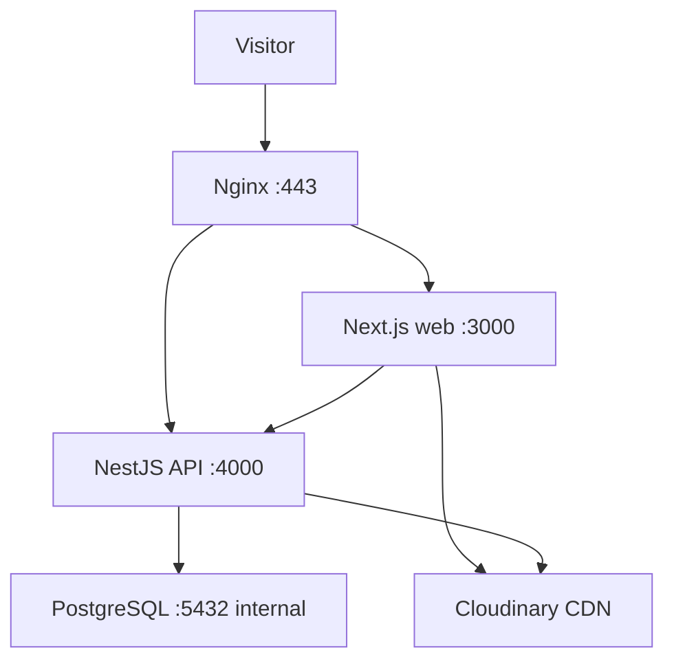

# Deployment

## 1. Purpose

This document defines the production deployment, infrastructure, release, backup, and recovery direction for Estetica Plus.

Target:

```text
Domain: esteticaplus.bg
Hosting: SuperHosting VPS
Operating system: Ubuntu 24.04 LTS or approved supported LTS
Deployment: Docker Compose
Reverse proxy: Nginx
TLS: Let's Encrypt
CI/CD: GitHub Actions
Database: PostgreSQL
Images: Cloudinary
```

Exact VPS plan and resource limits are selected after measuring the production build and expected traffic.

## 2. Production Topology



Public DNS:

```text
esteticaplus.bg      → VPS public IP
www.esteticaplus.bg  → canonical redirect or approved alias
api.esteticaplus.bg  → VPS public IP
```

Only Nginx exposes ports `80` and `443`.

PostgreSQL, Next.js, and NestJS are not directly exposed to the public internet.

## 3. Deployment Principles

- build once and deploy an immutable image;
- run production with pinned dependency versions and lockfile;
- separate build-time and runtime configuration;
- run database migrations as an explicit release step;
- do not run development schema synchronization in production;
- deploy only after required checks pass;
- keep the previous working application images available for rollback;
- never commit secrets;
- make health, logs, backups, and certificate renewal observable;
- test recovery instead of assuming it works.

## 4. Repository Deployment Files

Expected repository files:

```text
estetica-plus/
├── apps/
│   ├── web/
│   │   └── Dockerfile
│   └── api/
│       └── Dockerfile
├── deploy/
│   ├── nginx/
│   │   └── esteticaplus.conf
│   ├── scripts/
│   │   ├── deploy.sh
│   │   ├── backup-db.sh
│   │   ├── restore-db.sh
│   │   └── verify-deployment.sh
│   └── README.md
├── compose.yaml
├── compose.production.yaml
└── .github/
    └── workflows/
        ├── ci.yml
        └── deploy-production.yml
```

These names are the implementation direction. Do not create them until the relevant scaffold prompt is approved.

## 5. Containers

### Web

Runs the production Next.js application.

Requirements:

- multi-stage Docker build;
- production-only runtime output;
- non-root runtime user where supported;
- deterministic install from lockfile;
- health endpoint;
- no Cloudinary, database, JWT, or refresh secrets in browser bundles;
- only required build arguments exposed.

### API

Runs the NestJS application.

Requirements:

- multi-stage Docker build;
- generated Prisma client;
- production-only dependencies/runtime output;
- non-root runtime user;
- health endpoint;
- graceful shutdown;
- validated environment variables before accepting traffic.

### PostgreSQL

Requirements:

- supported PostgreSQL image pinned to an approved version;
- persistent named volume or explicit host-mounted data directory;
- internal Docker network only;
- health check;
- restricted credentials;
- no public port mapping;
- backup performed with PostgreSQL-aware tools, not only raw volume copies.

## 6. Docker Compose

Production Compose defines:

```text
web
api
postgres
```

Optional operational services such as a backup helper may be added only when their ownership is clear.

Rules:

- services share a private application network;
- database startup health is checked;
- API waits for readiness through retry behavior, not an unsafe fixed sleep;
- restart policies are appropriate for long-running services;
- container resource behavior is monitored;
- logs are retained with rotation;
- production values come from protected environment configuration;
- Compose files contain no real secrets.

## 7. Networks and Firewall

Host firewall direction:

```text
22/tcp   restricted administrative SSH
80/tcp   public HTTP for redirect/challenge
443/tcp  public HTTPS
```

Rules:

- deny unnecessary inbound ports;
- do not expose `3000`, `4000`, or `5432`;
- restrict SSH by source IP when operationally practical;
- disable password SSH login after key access is verified;
- disable direct root SSH login;
- protect against repeated authentication attempts;
- keep provider rescue-console access documented.

The final firewall configuration must account for SuperHosting management requirements before applying it.

## 8. Nginx

Nginx responsibilities:

- TLS termination;
- canonical host redirect;
- reverse proxy to Next.js and NestJS;
- forwarding trusted proxy headers;
- request-size limits;
- timeouts;
- security headers where globally appropriate;
- compression for suitable text responses;
- rate-limit support for selected public endpoints;
- access/error logs with rotation.

Routing:

```text
https://esteticaplus.bg       → web:3000
https://api.esteticaplus.bg   → api:4000
```

Rules:

- `www` has one explicit canonical behavior;
- preserve original scheme and host headers;
- configure the NestJS trusted-proxy behavior correctly;
- do not cache authenticated/admin/API responses indiscriminately;
- do not proxy Cloudinary image binaries through the VPS;
- restrict upload/body sizes according to endpoint needs;
- return a controlled maintenance/error response when upstream is unavailable.

## 9. TLS Certificates

Use Let's Encrypt with an approved ACME client.

Requirements:

- issue certificates only after DNS resolves correctly;
- redirect HTTP to HTTPS after validation;
- automate renewal;
- monitor renewal failure;
- test renewal with the provider-supported dry-run process;
- reload Nginx after successful renewal;
- keep private certificate material access-restricted.

Do not rely on a manual calendar reminder for certificate renewal.

## 10. DNS

Before launch:

- inventory all existing domain records;
- preserve required email records;
- lower TTL before migration when appropriate;
- create production `A`/`AAAA` records only when IPv6 is correctly configured;
- configure `www` according to the canonical strategy;
- configure `api`;
- verify from independent resolvers;
- restore normal TTL after stabilization.

DNS changes are performed deliberately because incorrect edits can affect both website and email.

## 11. Environment Separation

Environments:

```text
local
test
staging when introduced
production
```

Each environment has separate:

- database;
- token secrets;
- cookie/security configuration;
- Cloudinary folder or product environment;
- email sender/testing behavior;
- public URLs;
- observability configuration.

Production customer data is not copied into development without an approved anonymization process.

## 12. Environment Variables

Conceptual production configuration:

```text
NODE_ENV
WEB_PORT
API_PORT
PUBLIC_WEB_URL
PUBLIC_API_URL
DATABASE_URL
POSTGRES_DB
POSTGRES_USER
POSTGRES_PASSWORD
JWT_ACCESS_SECRET
REFRESH_TOKEN_SECRET_OR_PEPPER
COOKIE_DOMAIN
COOKIE_SECURE
CLOUDINARY_CLOUD_NAME
CLOUDINARY_API_KEY
CLOUDINARY_API_SECRET
EMAIL_PROVIDER_API_KEY
EMAIL_FROM
APP_TIMEZONE
```

Rules:

- maintain a committed `.env.example` with names and safe descriptions only;
- validate required values at process startup;
- never log secret values;
- never pass server secrets through `NEXT_PUBLIC_*`;
- rotate secrets through a documented process;
- GitHub Actions secrets are scoped to the production environment;
- the production runtime environment file has restrictive permissions.

## 13. CI Pipeline

Every pull request and main-branch update runs:

1. dependency installation from lockfile;
2. formatting check;
3. lint;
4. TypeScript type checks;
5. unit tests;
6. integration tests requiring PostgreSQL;
7. production builds for web and API;
8. Prisma schema/migration validation;
9. selected security/dependency checks;
10. end-to-end smoke tests where appropriate.

The pipeline fails on a required failed check.

Build artifacts must not contain `.env` files or production secrets.

## 14. Production Deployment Pipeline

Initial deployment trigger:

```text
approved push/merge to main
```

Production uses a protected GitHub environment and a single deployment concurrency group.

Recommended flow:

1. complete required CI;
2. build versioned web and API images;
3. identify the release by commit SHA;
4. transfer/pull the approved release on the VPS;
5. create a pre-migration database backup for risky migrations;
6. run `prisma migrate deploy` as a controlled one-off step;
7. start/update application containers;
8. wait for health checks;
9. run external smoke checks;
10. record deployment result;
11. retain previous image references for rollback.

Do not run two production deployments concurrently.

## 15. SSH Deployment Account

Use a dedicated limited deployment user.

Requirements:

- key-based authentication;
- no shared personal private key;
- least-privilege access;
- access only to required deployment paths and commands;
- known-host verification;
- key rotation/revocation procedure;
- deployment logs without secret output.

Avoid giving the CI user unrestricted root shell access. If narrowly scoped elevated commands are required, document and restrict them.

## 16. Database Migrations

Production command direction:

```text
prisma migrate deploy
```

Rules:

- migration files are reviewed and committed;
- migration is tested against a disposable PostgreSQL database;
- custom exclusion-constraint SQL is included in the reviewed migration;
- never use `prisma migrate dev` in production;
- never use an unsafe force-push schema synchronization;
- do not edit migrations already applied in shared environments;
- plan long-running locks and data backfills;
- take an appropriate backup before destructive or high-risk changes.

Application and schema changes must be backward-compatible during the chosen deployment strategy or require a documented maintenance window.

## 17. Health and Readiness

Suggested endpoints:

```text
GET /health/live
GET /health/ready
```

Liveness:

- confirms the process event loop/server is functioning;
- does not perform expensive dependency calls.

Readiness:

- confirms the application can serve traffic;
- checks essential dependencies with strict timeouts;
- does not expose credentials or detailed infrastructure.

Nginx/external smoke tests verify:

- BG homepage;
- EN homepage;
- API readiness;
- one public service request;
- TLS and canonical redirect.

## 18. Zero-Downtime Direction

The initial single-VPS Compose deployment may have a short controlled restart.

Requirements:

- graceful shutdown;
- short health-based cutover;
- no request accepted by an unready API;
- no migration race;
- clear maintenance plan for incompatible migrations.

True blue/green deployment may be added after operational need is measured. Do not claim zero downtime unless it is tested end to end.

## 19. Rollback

Rollback covers application and data separately.

### Application rollback

1. identify last known-good commit/images;
2. verify database compatibility;
3. redeploy previous web/API images;
4. run health and smoke checks;
5. record the incident.

### Database rollback

Automatic reverse migrations are not assumed safe.

For a damaging data/schema migration:

- stop writes if required;
- follow the reviewed recovery plan;
- restore from verified backup when necessary;
- document data-loss window;
- validate application and booking integrity before reopening.

Never roll back application code to a version incompatible with the already-applied schema.

## 20. PostgreSQL Backups

Minimum production policy:

- automated nightly logical backup;
- offsite object storage;
- encryption in transit and restricted access;
- retention rotation;
- checksum/integrity verification;
- monitored job success/failure;
- periodic restore test;
- pre-migration backup for high-risk releases.

Suggested initial retention direction:

```text
daily: 7
weekly: 4
monthly: 6
```

The final policy is approved against storage, privacy, and recovery needs.

Backup filenames contain timestamp, environment, database identity, and format, but no customer data.

## 21. Restore Procedure

The documented restore drill includes:

1. choose exact backup;
2. verify integrity;
3. provision an isolated PostgreSQL target;
4. restore;
5. apply only expected migrations;
6. run integrity and booking-conflict checks;
7. start API against the isolated database;
8. perform smoke tests;
9. record duration and findings;
10. destroy the isolated copy securely after the drill.

A successful backup job is not proof of recoverability.

## 22. Image Recovery

Cloudinary is the image system of record, but application metadata remains in PostgreSQL.

Requirements:

- protect Cloudinary administrator/API credentials;
- use archive/reference-aware deletion;
- configure provider backup/version behavior according to the selected plan;
- document recovery for deleted/replaced assets;
- avoid storing the only useful image identity outside PostgreSQL;
- export critical media inventory periodically if required.

Database backup alone does not restore deleted Cloudinary originals.

## 23. Persistent VPS Data

Persistent data:

- PostgreSQL volume;
- protected runtime configuration;
- TLS state where the selected ACME setup requires it;
- operational logs within retention policy;
- backup staging only for the minimum necessary period.

Disposable:

- containers;
- application build output;
- downloaded deployment artifacts after safe cleanup;
- caches.

Do not store user-uploaded production galleries as local VPS files.

## 24. Logging

Container and Nginx logs:

- use structured application logs;
- include timestamp, level, service, environment, and correlation ID;
- rotate and cap disk usage;
- never include passwords, raw tokens, secrets, full reset links, or unnecessary personal data;
- provide enough deployment/release identity for diagnosis.

Detailed metrics and alert rules belong in `docs/15-observability.md`.

## 25. Monitoring and Alerts

Minimum monitored conditions:

- website/API unavailable;
- readiness failing;
- high server disk usage;
- PostgreSQL storage growth;
- repeated application errors;
- failed deployment;
- failed database backup;
- certificate renewal failure;
- repeated notification failures;
- excessive CPU/memory or container restarts.

Alerts need a named recipient and response procedure before launch.

## 26. VPS Maintenance

- enable supported security updates with an approved reboot policy;
- review OS, Docker, Nginx, Node base images, PostgreSQL, and dependencies regularly;
- remove unused accounts and keys;
- review firewall rules;
- monitor disk space and inode use;
- prune unused Docker artifacts safely;
- test reboot recovery;
- document provider access, IPs, DNS, and renewal ownership;
- schedule major upgrades rather than applying them blindly.

## 27. Scaling

Initial vertical scaling:

- increase VPS CPU/RAM/storage after measurement;
- tune PostgreSQL connection pooling and memory deliberately;
- optimize slow queries and caches before adding infrastructure.

Future horizontal direction may include:

- separate managed/external PostgreSQL;
- multiple web/API instances;
- external job queue;
- dedicated object backup storage;
- load balancer;
- separate staging VPS.

Cloudinary already removes image bandwidth/storage load from the VPS.

## 28. Security Checklist

- SSH keys only;
- limited deploy user;
- firewall active and verified;
- database not public;
- TLS valid and auto-renewing;
- secrets not in repository/images/logs;
- protected GitHub production environment;
- third-party workflow actions pinned and reviewed;
- minimal GitHub token permissions;
- backups access-restricted;
- containers run with least practical privilege;
- dependencies and base images scanned/updated;
- production admin bootstrap handled securely.

## 29. First Deployment Runbook

1. provision supported VPS;
2. update OS and create administrative/deploy users;
3. configure SSH safely;
4. configure firewall;
5. install supported Docker Engine and Compose plugin;
6. create deployment directories with restricted ownership;
7. configure protected production environment;
8. configure DNS;
9. start PostgreSQL and verify persistence;
10. deploy API and web;
11. run migrations and approved seed;
12. configure Nginx;
13. issue TLS certificates;
14. run health and smoke checks;
15. configure backups and offsite transfer;
16. perform a restore test;
17. configure monitoring and alerts;
18. connect Search Console after public launch;
19. record the final infrastructure inventory.

## 30. Acceptance Criteria

- only ports 80/443 and restricted SSH are reachable;
- PostgreSQL has no public port;
- web and API use production builds;
- all runtime configuration validates;
- CI blocks broken releases;
- production deployments cannot overlap;
- migrations run once in a controlled step;
- health checks and external smoke checks pass;
- TLS redirects and renewal work;
- backups run offsite and restore successfully;
- previous compatible app version can be restored;
- Cloudinary assets are not proxied through the VPS;
- production secrets are absent from Git and client bundles;
- server reboot restores required services safely;
- deployment and backup failures generate actionable alerts.

## 31. Official References

- Docker production guidance: <https://docs.docker.com/compose/how-tos/production/>
- Docker Compose startup order and health: <https://docs.docker.com/compose/how-tos/startup-order/>
- GitHub Actions: <https://docs.github.com/actions>
- GitHub Actions secrets: <https://docs.github.com/actions/security-guides/using-secrets-in-github-actions>
- GitHub Actions secure use: <https://docs.github.com/actions/security-guides/security-hardening-for-github-actions>
- Prisma production migrations: <https://www.prisma.io/docs/orm/prisma-client/deployment/deploy-database-changes-with-prisma-migrate>
- Let's Encrypt documentation: <https://letsencrypt.org/docs/>

