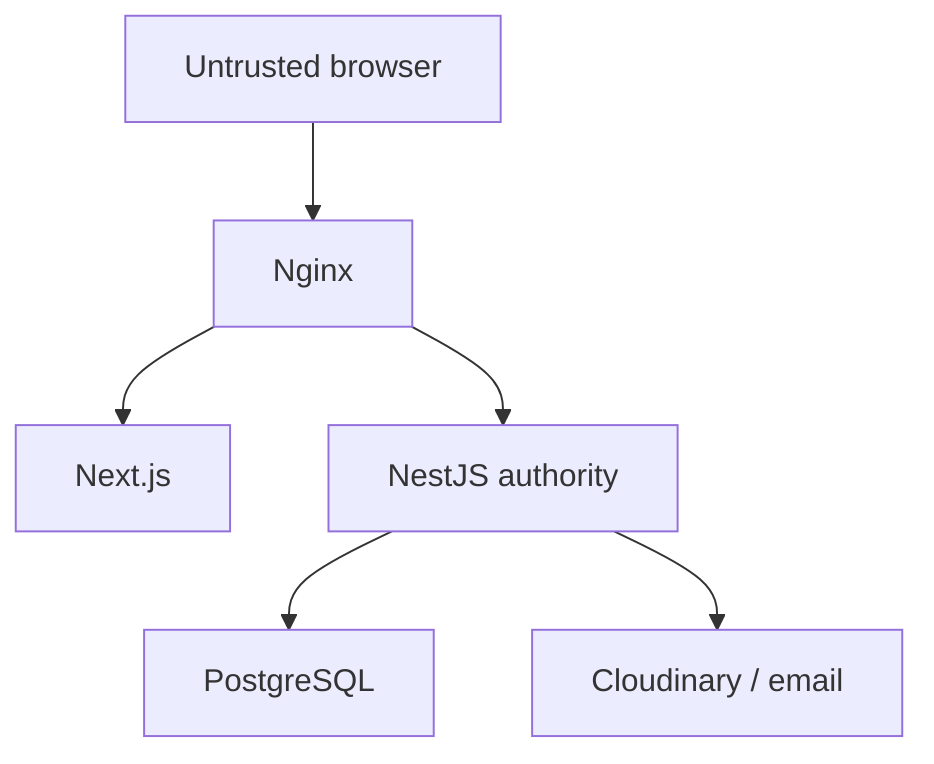

# Security

## 1. Purpose

This document defines application, infrastructure, account, data, upload, and operational security requirements for Estetica Plus.

It complements:

- `docs/06-auth.md`;
- `docs/07-images.md`;
- `docs/08-booking-engine.md`;
- `docs/10-deployment.md`.

Security controls must exist in implementation and tests, not only in UI visibility or documentation.

## 2. Security Principles

- deny by default;
- validate every untrusted input;
- authorize every protected action in NestJS;
- minimize stored and exposed personal data;
- use proven libraries and platform primitives;
- keep secrets out of source, browser bundles, and logs;
- separate public, customer, staff, admin, and infrastructure boundaries;
- preserve auditability for sensitive actions;
- design recovery before incidents;
- review meaningful architectural changes through ADRs.

## 3. Protected Assets

- customer identity and contact data;
- appointment and treatment history;
- account credentials and sessions;
- administrator capabilities;
- service prices and publication controls;
- working schedules and internal notes;
- before-and-after consent state;
- Cloudinary signing credentials;
- email provider credentials;
- PostgreSQL data and backups;
- GitHub/VPS deployment credentials.

## 4. Trust Boundaries



Rules:

- browser calculations are never authoritative;
- Next.js middleware is not final authorization;
- NestJS owns authentication, authorization, validation, and business rules;
- Prisma uses parameterized APIs;
- external provider responses are validated;
- public IDs and URLs do not prove ownership.

## 5. Authentication

Approved:

- NestJS-managed credentials;
- modern password hashing such as Argon2id;
- short-lived access token;
- rotating refresh token;
- refresh token in `HttpOnly`, `Secure`, appropriate `SameSite` cookie;
- access token kept in memory, not `localStorage`;
- password reset with single-use hashed random token;
- neutral account-recovery responses;
- session revocation and reuse detection.

Detailed requirements remain in `docs/06-auth.md`.

## 6. Authorization

Roles:

```text
CUSTOMER
STAFF
ADMIN
SUPER_ADMIN
```

Every protected endpoint checks:

1. valid session/token;
2. active account;
3. role or permission;
4. resource ownership/scope;
5. valid business transition.

Examples:

- customer can view only verified owned appointments;
- staff sees only operationally required data;
- admin cannot assign administrator roles;
- `SUPER_ADMIN` is reserved for sensitive operations;
- guest reference code alone does not grant appointment access.

## 7. Input Validation

NestJS applies global DTO validation with:

- allowlisted properties;
- transformation only where explicit;
- rejection of unknown/forbidden fields;
- type, length, enum, and format constraints;
- semantic domain validation.

Validate:

- IDs;
- locale;
- dates and timezone;
- service, staff, room, and device relationships;
- prices and durations;
- notes and rich content;
- email and phone;
- pagination/sorting;
- upload completion results.

Client validation improves experience but is never authoritative.

## 8. Injection Prevention

- use Prisma parameterized queries;
- raw SQL is restricted, reviewed, and parameterized;
- never interpolate untrusted values into SQL;
- allowlist sortable/filterable fields;
- never construct shell commands from request data;
- avoid evaluating dynamic code;
- sanitize rich content at write/render boundaries;
- encode output according to context;
- validate URLs before any server-side fetch.

## 9. Cross-Site Scripting

- React escaping remains enabled;
- avoid `dangerouslySetInnerHTML`;
- approved rich text uses a restrictive schema and sanitization;
- never store arbitrary script/style/embed content from normal editors;
- Content Security Policy is introduced and tested;
- user/customer notes render as plain text;
- review content renders safely;
- Cloudinary metadata and filenames are treated as untrusted strings.

## 10. CSRF

Bearer access-token API calls use the authorization header.

Cookie-authenticated endpoints such as refresh/logout require:

- allowed-origin validation;
- suitable `SameSite`;
- explicit CSRF token strategy when needed;
- restricted CORS;
- no state-changing `GET`;
- secure cookie scope.

Admin actions must not depend on obscurity or custom headers alone without reviewing the final request model.

## 11. CORS

Production allowlist includes only approved web origins.

Rules:

- no wildcard origin with credentials;
- environment-specific origin list;
- restrict methods and headers;
- preflight behavior tested;
- reject null/unexpected origins where appropriate;
- configure trusted proxy/client IP correctly behind Nginx.

## 12. Security Headers

Apply and test:

- Content Security Policy;
- `X-Content-Type-Options: nosniff`;
- clickjacking protection through CSP `frame-ancestors`;
- strict referrer policy;
- permissions policy;
- HSTS after HTTPS is stable;
- appropriate cache controls for authenticated/private responses.

Helmet may provide baseline headers, but the final policy is explicitly configured and tested.

## 13. Rate Limiting and Abuse

Stricter limits for:

- login;
- registration;
- password reset;
- email verification resend;
- refresh;
- guest appointment access;
- availability enumeration;
- slot-hold creation and release;
- appointment creation;
- cancellation/rescheduling;
- contact/review submission;
- Cloudinary upload signing.

Rules:

- account and IP dimensions where appropriate;
- correct client IP behind trusted proxy;
- safe error response;
- limits configurable;
- distributed storage considered if API scales horizontally;
- rate limiting supplements authorization and DB constraints.

## 14. Booking Security

- server calculates availability and price meaning;
- specialist duration overrides are resolved on the server;
- `bookingDurationMinutes` is the complete blocked interval;
- clicking “Continue” creates a 10-minute server-side hold;
- hold tokens are high-entropy opaque values and only hashes are stored;
- hold tokens are scoped to the held flow and never expose allocation IDs;
- server time, status, and expiry are authoritative;
- transaction creates hold/appointment allocations and converts a hold at most once;
- PostgreSQL exclusion constraint prevents overlap between holds and appointments;
- rate limits and bounded active holds prevent deliberate slot hoarding;
- expired/released holds cannot be converted;
- idempotency prevents duplicate retry booking;
- status transitions are allowlisted;
- customer cancellation/rescheduling checks ownership and snapshots;
- admin-created bookings use the same conflict protection;
- public errors never reveal who occupies a slot.

## 15. File and Image Upload Security

- authorized admins only;
- signed, short-lived Cloudinary upload parameters;
- allowlisted types;
- MIME, extension, size, and upload result validation;
- generated/stable safe public IDs;
- no customer data in filenames/public IDs;
- ordinary SVG upload disabled unless separately secured;
- no API secret in browser;
- reference-aware deletion;
- restricted/private media uses appropriate delivery controls;
- before-and-after publication requires consent.

## 16. SSRF and External URLs

Phase 1 avoids arbitrary server-side URL fetching.

If introduced:

- allowlist destinations/protocols;
- block localhost, link-local, private, and metadata ranges;
- resolve DNS safely;
- set strict timeouts and response limits;
- disable unsafe redirects;
- validate content;
- do not forward credentials;
- log safe failure context.

## 17. Secrets

Secrets include:

- JWT/token keys;
- database password;
- Cloudinary API secret;
- email provider key;
- deployment SSH key;
- backup-storage credentials.

Rules:

- never commit;
- never place in `NEXT_PUBLIC_*`;
- never include in images or artifacts;
- scope by environment;
- restrict access;
- rotate on exposure and periodically as required;
- document owner and rotation procedure;
- do not print in CI/runtime logs;
- use `.env.example` with placeholders only.

## 18. Personal Data and Privacy

Collect only what is necessary.

Separate:

- booking communication;
- account identity;
- optional marketing consent;
- before-and-after publication consent.

Rules:

- do not expose history on unverified email/phone match;
- mask list-view data where practical;
- restrict internal notes;
- do not log unnecessary contact/treatment data;
- define retention and deletion workflows;
- include privacy policy and data-subject process before launch;
- review whether any treatment data has heightened legal sensitivity.

Legal/privacy details require qualified review; this document does not replace legal advice.

## 19. Database

- PostgreSQL internal network only;
- unique limited application credentials;
- least-privilege operational accounts;
- Prisma as the normal data boundary;
- migrations reviewed and controlled;
- backups encrypted/access-restricted;
- restoration tested;
- production database unavailable from public internet;
- no shared production credentials in local development.

## 20. Logging and Audit

Never log:

- passwords;
- raw access/refresh/reset/verification tokens;
- cookies/authorization headers;
- secrets;
- full private notes;
- unnecessary personal/health information.

Audit:

- role/session security changes;
- appointment status/reschedule/cancel;
- service price/duration;
- schedule/resource changes;
- customer merge/link;
- publication and media deletion;
- before/after consent actions.

Audit records are access-restricted and tamper-resistant within the application model.

## 21. Errors

- return stable safe error codes;
- never expose stack traces or SQL details publicly;
- distinguish user-safe validation/conflict from internal errors;
- use correlation IDs;
- production error pages contain no internals;
- error-monitoring payloads are scrubbed.

## 22. Infrastructure

- HTTPS only;
- restricted SSH key access;
- firewall;
- no public app/database ports;
- non-root container users where practical;
- patched OS/base images/dependencies;
- limited deployment user;
- protected GitHub environment;
- minimal workflow token permissions;
- backups offsite;
- certificate/backup/deployment monitoring.

## 23. Dependency and Supply Chain

- commit lockfile;
- deterministic CI installs;
- review new dependencies for necessity and maintenance;
- pin/review GitHub Actions;
- scan dependencies and container images;
- respond to relevant advisories;
- remove unused packages;
- do not run untrusted PR code with production secrets;
- document major dependency upgrades.

## 24. Admin Security

- no public admin registration;
- role provisioning audited;
- `SUPER_ADMIN` rare;
- stronger MFA direction for privileged accounts;
- session revocation;
- re-authentication for highly sensitive actions when introduced;
- sensitive data minimized in tables;
- destructive changes explicit;
- stale-update protection;
- admin routes use `noindex` but security does not rely on it.

## 25. Email and Notifications

- verify sender-domain records;
- do not include unnecessary sensitive details;
- reset/verification links are HTTPS, random, short-lived, single-use;
- no secrets in templates;
- delivery callbacks/webhooks validated if used;
- notification retries idempotent;
- account existence not revealed by recovery response.

## 26. Threat Modeling

Before each major phase, review:

- assets;
- actors;
- entry points;
- trust boundaries;
- abuse cases;
- controls;
- residual risk.

Mandatory review areas:

- auth/customer portal;
- guest appointment management;
- booking concurrency;
- admin roles;
- uploads/before-after;
- deployment/backups;
- future payments.

## 27. Security Testing

Automated:

- authorization matrix;
- ownership/IDOR attempts;
- DTO unknown-field rejection;
- auth/session/CSRF/CORS;
- rate limiting;
- upload validation;
- booking concurrency;
- SQL/query safety;
- dependency/container scanning;
- secret scanning.

Manual before launch:

- privileged workflow review;
- account enumeration;
- reset/session abuse;
- admin access;
- stored/reflected XSS;
- upload bypass attempts;
- sensitive data in logs/responses;
- infrastructure exposure;
- backup access and restore.

## 28. Incident Response

Document:

1. detection and triage;
2. responsible contacts;
3. containment;
4. credential/session revocation;
5. evidence preservation without overexposure;
6. recovery;
7. user/regulatory communication assessment;
8. root-cause review;
9. corrective tests and controls.

Do not delete relevant logs during active investigation.

## 29. Launch Checklist

- authorization tests pass;
- no public PostgreSQL/app ports;
- TLS/security headers validated;
- CORS/CSRF policy tested;
- secrets absent from repo/bundles/logs;
- production admin created securely;
- privileged role workflow audited;
- rate limits configured behind proxy;
- upload restrictions tested;
- guest history requires verification;
- booking exclusion constraint tested concurrently;
- backups/restores tested;
- privacy/consent text approved;
- error monitoring scrubs sensitive data;
- dependency and container scans reviewed;
- incident contacts and procedures documented.

## 30. Acceptance Criteria

- all protected actions are authorized by NestJS;
- customer ownership is enforced;
- browser values never determine authoritative price, role, or slot;
- session strategy follows `docs/06-auth.md`;
- production secrets never reach client code;
- uploads cannot bypass role/type/size validation;
- booking cannot double-allocate resources;
- private data is absent from public errors/logs;
- infrastructure exposes only intended ports;
- backups and incident recovery are testable;
- security regressions block release.

## 31. Official References

- OWASP Cheat Sheet Series: <https://cheatsheetseries.owasp.org/>
- OWASP Authentication: <https://cheatsheetseries.owasp.org/cheatsheets/Authentication_Cheat_Sheet.html>
- OWASP Session Management: <https://cheatsheetseries.owasp.org/cheatsheets/Session_Management_Cheat_Sheet.html>
- OWASP CSRF: <https://cheatsheetseries.owasp.org/cheatsheets/Cross-Site_Request_Forgery_Prevention_Cheat_Sheet.html>
- OWASP Input Validation: <https://cheatsheetseries.owasp.org/cheatsheets/Input_Validation_Cheat_Sheet.html>
- OWASP File Upload: <https://cheatsheetseries.owasp.org/cheatsheets/File_Upload_Cheat_Sheet.html>
- NestJS security: <https://docs.nestjs.com/security/authentication>
- NestJS validation: <https://docs.nestjs.com/techniques/validation>
